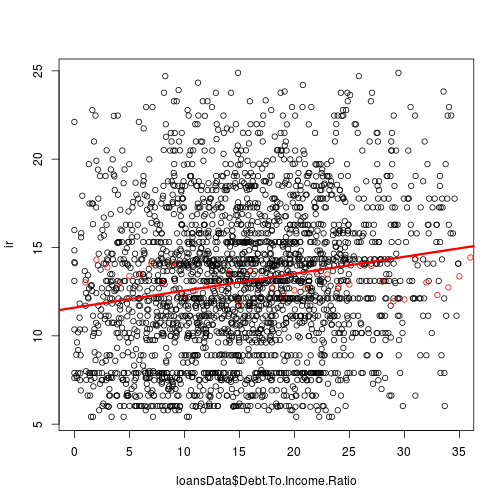

Exploratory analysis
========================================================


Download the data, read the data in and save the raw data as an RDA file


```r
getwd()
```

```
## [1] "/dvt/workspace/r-data-analysis-course/assignment-1/work/code/finalcode"
```

```r
download.file("https://spark-public.s3.amazonaws.com/dataanalysis/loansData.csv", 
    destfile = "../../data/raw/loansData.csv", method = "curl")
dateDownloaded <- date()
dateDownloaded
```

```
## [1] "Mon Feb 18 01:54:07 2013"
```

```r
loansData <- read.csv("../../data/raw/loansData.csv")
save(loansData, dateDownloaded, file = "../../data/raw/loansData.rda")
```


### Fix incorrect types

```r
loansData$Interest.Rate <- sapply(loansData$Interest.Rate, function(x) as.numeric(sub("%", 
    "", x)))
loansData$Debt.To.Income.Ratio <- sapply(loansData$Debt.To.Income.Ratio, function(x) as.numeric(sub("%", 
    "", x)))
```


### Look at the data set


```r
str(loansData)
```

```
## 'data.frame':	2500 obs. of  14 variables:
##  $ Amount.Requested              : int  20000 19200 35000 10000 12000 6000 10000 33500 14675 7000 ...
##  $ Amount.Funded.By.Investors    : num  20000 19200 35000 9975 12000 ...
##  $ Interest.Rate                 : num  8.9 12.12 21.98 9.99 11.71 ...
##  $ Loan.Length                   : Factor w/ 2 levels "36 months","60 months": 1 1 2 1 1 1 1 2 1 1 ...
##  $ Loan.Purpose                  : Factor w/ 14 levels "car","credit_card",..: 3 3 3 3 2 10 3 2 2 2 ...
##  $ Debt.To.Income.Ratio          : num  14.9 28.4 23.8 14.3 18.8 ...
##  $ State                         : Factor w/ 46 levels "AK","AL","AR",..: 37 39 5 16 28 7 19 18 5 5 ...
##  $ Home.Ownership                : Factor w/ 5 levels "MORTGAGE","NONE",..: 1 1 1 1 5 4 5 1 5 5 ...
##  $ Monthly.Income                : num  6542 4583 11500 3833 3195 ...
##  $ FICO.Range                    : Factor w/ 38 levels "640-644","645-649",..: 20 16 11 12 12 7 17 14 10 16 ...
##  $ Open.CREDIT.Lines             : int  14 12 14 10 11 17 10 12 9 8 ...
##  $ Revolving.CREDIT.Balance      : int  14272 11140 21977 9346 14469 10391 15957 27874 7246 7612 ...
##  $ Inquiries.in.the.Last.6.Months: int  2 1 1 0 0 2 0 0 1 0 ...
##  $ Employment.Length             : Factor w/ 12 levels "10+ years","< 1 year",..: 2 4 4 7 11 5 1 1 10 5 ...
```

```r
sapply(loansData, summary)
```

```
## $Amount.Requested
##    Min. 1st Qu.  Median    Mean 3rd Qu.    Max. 
##    1000    6000   10000   12400   17000   35000 
## 
## $Amount.Funded.By.Investors
##    Min. 1st Qu.  Median    Mean 3rd Qu.    Max. 
##       0    6000   10000   12000   16000   35000 
## 
## $Interest.Rate
##    Min. 1st Qu.  Median    Mean 3rd Qu.    Max. 
##    5.42   10.20   13.10   13.10   15.80   24.90 
## 
## $Loan.Length
## 36 months 60 months 
##      1952       548 
## 
## $Loan.Purpose
##                car        credit_card debt_consolidation 
##                 50                444               1307 
##        educational   home_improvement              house 
##                 15                152                 20 
##     major_purchase            medical             moving 
##                101                 30                 29 
##              other   renewable_energy     small_business 
##                201                  4                 87 
##           vacation            wedding 
##                 21                 39 
## 
## $Debt.To.Income.Ratio
##    Min. 1st Qu.  Median    Mean 3rd Qu.    Max. 
##    0.00    9.75   15.30   15.40   20.70   34.90 
## 
## $State
##  AK  AL  AR  AZ  CA  CO  CT  DC  DE  FL  GA  HI  IA  IL  IN  KS  KY  LA 
##  11  38  13  46 433  61  50  11   8 169  98  12   1 101   3  21  23  22 
##  MA  MD  MI  MN  MO  MS  MT  NC  NH  NJ  NM  NV  NY  OH  OK  OR  PA  RI 
##  73  68  45  38  33   1   7  64  15  94  13  32 255  71  21  30  96  15 
##  SC  SD  TX  UT  VA  VT  WA  WI  WV  WY 
##  28   4 174  16  78   5  58  26  15   4 
## 
## $Home.Ownership
## MORTGAGE     NONE    OTHER      OWN     RENT 
##     1148        1        5      200     1146 
## 
## $Monthly.Income
##    Min. 1st Qu.  Median    Mean 3rd Qu.    Max.    NA's 
##     588    3500    5000    5690    6800  103000       1 
## 
## $FICO.Range
## 640-644 645-649 650-654 655-659 660-664 665-669 670-674 675-679 680-684 
##       5       3       1       4     125     145     171     166     157 
## 685-689 690-694 695-699 700-704 705-709 710-714 715-719 720-724 725-729 
##     138     140     153     131     134     112      93     114      94 
## 730-734 735-739 740-744 745-749 750-754 755-759 760-764 765-769 770-774 
##      94      65      53      54      61      46      46      36      17 
## 775-779 780-784 785-789 790-794 795-799 800-804 805-809 810-814 815-819 
##      22      28      19      20      13      13      11       8       6 
## 820-824 830-834 
##       1       1 
## 
## $Open.CREDIT.Lines
##    Min. 1st Qu.  Median    Mean 3rd Qu.    Max.    NA's 
##     2.0     7.0     9.0    10.1    13.0    38.0       2 
## 
## $Revolving.CREDIT.Balance
##    Min. 1st Qu.  Median    Mean 3rd Qu.    Max.    NA's 
##       0    5590   11000   15200   18900  271000       2 
## 
## $Inquiries.in.the.Last.6.Months
##    Min. 1st Qu.  Median    Mean 3rd Qu.    Max.    NA's 
##   0.000   0.000   0.000   0.906   1.000   9.000       2 
## 
## $Employment.Length
## 10+ years  < 1 year    1 year   2 years   3 years   4 years   5 years 
##       653       250       177       244       235       192       202 
##   6 years   7 years   8 years   9 years       n/a 
##       163       127       108        72        77
```


### Find out about missing values and remove the incomplete

```r
sum(is.na(loansData))
```

```
## [1] 7
```

```r
loansData <- loansData[complete.cases(loansData), ]
```


## Exploratory analysis

### Make some univariate plots/summaries


```r
loansData$FICO <- sapply(as.character(loansData$FICO.Range), function(s) as.numeric(substr(s, 
    0, 3)))

# interest rate seems interesting
hist(loansData$Interest.Rate, breaks = 100)
```

 

```r
# as if there were two distributions...
hist(log10(loansData$Interest.Rate), breaks = 100, prob = T)
```

 

```r

# this is interesting, there is a 'required' minimum
hist(loansData$FICO, breaks = 100)
```

 

```r

# is this increasing lineary? it seems like...
quantile(loansData$FICO, na.rm = T, probs = seq(0, 1, 0.05))
```

```
##   0%   5%  10%  15%  20%  25%  30%  35%  40%  45%  50%  55%  60%  65%  70% 
##  640  660  665  670  675  680  680  685  690  695  700  705  710  715  720 
##  75%  80%  85%  90%  95% 100% 
##  725  735  745  755  775  830
```

```r

# investors obviously prefer borrowers who don't have too high ratio of
# indebtness, but it is not too strong
hist(loansData$Debt.To.Income.Ratio)
```

 

```r

# and few credit lines
hist(loansData$Open.CREDIT.Lines, breaks = 100)
```

 

```r
hist(as.numeric(cut(loansData$Open.CREDIT.Lines, breaks = seq(0, 30, 1))))
```

 

```r


# my understanding is that only borrowers who do not already own too much,
# are welcomed TODO: look at the relationship between CB ~ FICO
quantile(loansData$Revolving.CREDIT.Balance, na.rm = T, probs = seq(0, 1, 0.05))
```

```
##       0%       5%      10%      15%      20%      25%      30%      35% 
##      0.0    917.7   2299.1   3531.4   4645.2   5585.8   6563.9   7495.7 
##      40%      45%      50%      55%      60%      65%      70%      75% 
##   8576.6   9718.2  10962.0  12099.6  13494.2  14835.1  16664.2  18888.8 
##      80%      85%      90%      95%     100% 
##  21527.2  25445.3  30268.1  40788.8 270800.0
```

```r
hist(loansData$Revolving.CREDIT.Balance, breaks = 100)
```

 

```r
# needs transformation...
hist(log(loansData$Revolving.CREDIT.Balance), breaks = 100)
```

 


So it seems that FICO must be > 650 for the loan to be approved. And we have got some terms to check for relations

### Fix the distribution scales

```r

loansData$logIncome <- log10(loansData$Monthly.Income + 1)
loansData$logRevCredit <- log(loansData$Revolving.CREDIT.Balance + 1)
# I want the median to be intercepted first
loansData$FICO.Ordered <- relevel(loansData$FICO.Range, ref = "700-704")
```


### Check out relationship with Interest Rate (IR)

```r
ir <- loansData$Interest.Rate
par(las = 3)
par(mar = c(6, 2, 1, 1))
boxplot(ir ~ loansData$Loan.Purpose)
```

 

```r
# it seems significant, but in the end i decided not to use it
anova(lm(ir ~ loansData$Loan.Purpose))
```

```
## Analysis of Variance Table
## 
## Response: ir
##                          Df Sum Sq Mean Sq F value  Pr(>F)    
## loansData$Loan.Purpose   13   1630   125.4    7.42 1.6e-14 ***
## Residuals              2484  41957    16.9                    
## ---
## Signif. codes:  0 '***' 0.001 '**' 0.01 '*' 0.05 '.' 0.1 ' ' 1
```

```r


boxplot(ir ~ loansData$Home.Ownership)
```

 

```r
anova(lm(ir ~ loansData$Home.Ownership))
```

```
## Analysis of Variance Table
## 
## Response: ir
##                            Df Sum Sq Mean Sq F value  Pr(>F)    
## loansData$Home.Ownership    3    311   103.6    5.97 0.00047 ***
## Residuals                2494  43276    17.4                    
## ---
## Signif. codes:  0 '***' 0.001 '**' 0.01 '*' 0.05 '.' 0.1 ' ' 1
```

```r

# a linear relationn between IR an FICO?
boxplot(ir ~ loansData$FICO.Range)
```

 

```r

# no relation between IR and Employment length
boxplot(ir ~ loansData$Employment.Length)
```

 

```r

# IR clearly depends on the length (which is logical, but it is
# interesting that shorter terms have lower IR)
boxplot(ir ~ loansData$Loan.Length)
```

 

```r

# am i seeing that poorer will get poorer? and richer pay less?
boxplot(ir ~ cut(loansData$Debt.To.Income.Ratio, breaks = seq(0, max(loansData$Debt.To.Income.Ratio, 
    na.rm = T), max(loansData$Debt.To.Income.Ratio, na.rm = T)/20)))
```

 

```r

# different cut
boxplot(ir ~ cut(loansData$Debt.To.Income.Ratio, breaks = 10))
```

 

```r


# finally, IR may depend on the ammount requested
plot(y = loansData$Interest.Rate, x = loansData$Amount.Requested, log = "xy")
```

 

```r

# also Dept to income ratio may represent a linear relationship
plot(y = loansData$Interest.Rate, x = loansData$Debt.To.Income.Ratio, log = "y")
```

 

```r

# but there is no relationship with monthly income
plot(y = loansData$Interest.Rate, x = loansData$Monthly.Income, log = "xy")
```

 

```r
lm1 <- lm(log(ir) ~ log(loansData$Monthly.Income))
summary(lm1)
```

```
## 
## Call:
## lm(formula = log(ir) ~ log(loansData$Monthly.Income))
## 
## Residuals:
##     Min      1Q  Median      3Q     Max 
## -0.8353 -0.2038  0.0554  0.2447  0.7016 
## 
## Coefficients:
##                               Estimate Std. Error t value Pr(>|t|)    
## (Intercept)                     2.3996     0.1106   21.70   <2e-16 ***
## log(loansData$Monthly.Income)   0.0137     0.0130    1.05     0.29    
## ---
## Signif. codes:  0 '***' 0.001 '**' 0.01 '*' 0.05 '.' 0.1 ' ' 1 
## 
## Residual standard error: 0.339 on 2496 degrees of freedom
## Multiple R-squared: 0.000443,	Adjusted R-squared: 4.25e-05 
## F-statistic: 1.11 on 1 and 2496 DF,  p-value: 0.293
```

```r

# but there might be with the Revolving credit balance
plot(y = log(loansData$Interest.Rate + 1), x = log(loansData$Revolving.CREDIT.Balance + 
    1))
```

 

```r
lm1 <- lm(log(loansData$Interest.Rate + 1) ~ log(loansData$Revolving.CREDIT.Balance + 
    1))
summary(lm1)
```

```
## 
## Call:
## lm(formula = log(loansData$Interest.Rate + 1) ~ log(loansData$Revolving.CREDIT.Balance + 
##     1))
## 
## Residuals:
##     Min      1Q  Median      3Q     Max 
## -0.7767 -0.1990  0.0403  0.2211  0.7892 
## 
## Coefficients:
##                                             Estimate Std. Error t value
## (Intercept)                                  2.35103    0.03546   66.30
## log(loansData$Revolving.CREDIT.Balance + 1)  0.02732    0.00387    7.06
##                                             Pr(>|t|)    
## (Intercept)                                  < 2e-16 ***
## log(loansData$Revolving.CREDIT.Balance + 1)  2.1e-12 ***
## ---
## Signif. codes:  0 '***' 0.001 '**' 0.01 '*' 0.05 '.' 0.1 ' ' 1 
## 
## Residual standard error: 0.308 on 2496 degrees of freedom
## Multiple R-squared: 0.0196,	Adjusted R-squared: 0.0192 
## F-statistic: 49.9 on 1 and 2496 DF,  p-value: 2.14e-12
```


## Modeling


## Fit a basic model relating IR to other vars, namely

 * FICO (maybe cut by quantiles)
 * Debt.To.Income.Ratio
 * Open.CREDIT.Lines [found not interesting]
 * Credit.Balance
 * Loan.Length
 * Ownership (but only for the category NONE?)
 * Purpose (especially: educational, car, renevable_energy)


```r

# FICO is the base
ir <- loansData$Interest.Rate
lmFico <- lm(ir ~ loansData$FICO.Ordered)
summary(lmFico)
```

```
## 
## Call:
## lm(formula = ir ~ loansData$FICO.Ordered)
## 
## Residuals:
##    Min     1Q Median     3Q    Max 
## -8.147 -2.037 -0.493  1.668 10.403 
## 
## Coefficients:
##                               Estimate Std. Error t value Pr(>|t|)    
## (Intercept)                     13.357      0.248   53.85  < 2e-16 ***
## loansData$FICO.Ordered640-644    1.855      1.294    1.43  0.15167    
## loansData$FICO.Ordered645-649    1.526      1.658    0.92  0.35722    
## loansData$FICO.Ordered650-654    1.773      2.850    0.62  0.53385    
## loansData$FICO.Ordered655-659    1.573      1.441    1.09  0.27505    
## loansData$FICO.Ordered660-664    5.136      0.355   14.47  < 2e-16 ***
## loansData$FICO.Ordered665-669    4.091      0.342   11.96  < 2e-16 ***
## loansData$FICO.Ordered670-674    2.892      0.330    8.77  < 2e-16 ***
## loansData$FICO.Ordered675-679    2.498      0.332    7.53  7.1e-14 ***
## loansData$FICO.Ordered680-684    1.770      0.336    5.27  1.5e-07 ***
## loansData$FICO.Ordered685-689    1.330      0.347    3.83  0.00013 ***
## loansData$FICO.Ordered690-694    1.375      0.345    3.99  6.9e-05 ***
## loansData$FICO.Ordered695-699    0.790      0.338    2.34  0.01948 *  
## loansData$FICO.Ordered705-709   -0.697      0.349   -2.00  0.04579 *  
## loansData$FICO.Ordered710-714   -0.924      0.365   -2.53  0.01152 *  
## loansData$FICO.Ordered715-719   -2.175      0.385   -5.65  1.8e-08 ***
## loansData$FICO.Ordered720-724   -2.321      0.364   -6.38  2.1e-10 ***
## loansData$FICO.Ordered725-729   -2.704      0.384   -7.05  2.4e-12 ***
## loansData$FICO.Ordered730-734   -3.401      0.384   -8.86  < 2e-16 ***
## loansData$FICO.Ordered735-739   -3.733      0.431   -8.67  < 2e-16 ***
## loansData$FICO.Ordered740-744   -3.765      0.462   -8.15  5.9e-16 ***
## loansData$FICO.Ordered745-749   -3.455      0.459   -7.53  7.3e-14 ***
## loansData$FICO.Ordered750-754   -4.889      0.440  -11.11  < 2e-16 ***
## loansData$FICO.Ordered755-759   -4.361      0.487   -8.96  < 2e-16 ***
## loansData$FICO.Ordered760-764   -4.729      0.487   -9.72  < 2e-16 ***
## loansData$FICO.Ordered765-769   -5.574      0.534  -10.43  < 2e-16 ***
## loansData$FICO.Ordered770-774   -6.604      0.732   -9.02  < 2e-16 ***
## loansData$FICO.Ordered775-779   -4.613      0.654   -7.05  2.3e-12 ***
## loansData$FICO.Ordered780-784   -5.768      0.591   -9.76  < 2e-16 ***
## loansData$FICO.Ordered785-789   -4.859      0.697   -6.97  4.0e-12 ***
## loansData$FICO.Ordered790-794   -5.796      0.682   -8.51  < 2e-16 ***
## loansData$FICO.Ordered795-799   -4.965      0.826   -6.01  2.1e-09 ***
## loansData$FICO.Ordered800-804   -5.701      0.856   -6.66  3.4e-11 ***
## loansData$FICO.Ordered805-809   -5.931      0.891   -6.65  3.5e-11 ***
## loansData$FICO.Ordered810-814   -5.063      1.034   -4.90  1.0e-06 ***
## loansData$FICO.Ordered815-819   -6.432      1.185   -5.43  6.3e-08 ***
## loansData$FICO.Ordered820-824   -5.457      2.850   -1.91  0.05562 .  
## loansData$FICO.Ordered830-834   -5.737      2.850   -2.01  0.04421 *  
## ---
## Signif. codes:  0 '***' 0.001 '**' 0.01 '*' 0.05 '.' 0.1 ' ' 1 
## 
## Residual standard error: 2.84 on 2460 degrees of freedom
## Multiple R-squared: 0.545,	Adjusted R-squared: 0.538 
## F-statistic: 79.7 on 37 and 2460 DF,  p-value: <2e-16
```

```r


# Debt.To.Income.Ratio might be useful
lmDebRatio <- lm(ir ~ loansData$Debt.To.Income.Ratio)
summary(lmDebRatio)
```

```
## 
## Call:
## lm(formula = ir ~ loansData$Debt.To.Income.Ratio)
## 
## Residuals:
##    Min     1Q Median     3Q    Max 
## -8.794 -3.014 -0.117  2.605 12.313 
## 
## Coefficients:
##                                Estimate Std. Error t value Pr(>|t|)    
## (Intercept)                     11.5948     0.1880   61.69   <2e-16 ***
## loansData$Debt.To.Income.Ratio   0.0959     0.0110    8.73   <2e-16 ***
## ---
## Signif. codes:  0 '***' 0.001 '**' 0.01 '*' 0.05 '.' 0.1 ' ' 1 
## 
## Residual standard error: 4.12 on 2496 degrees of freedom
## Multiple R-squared: 0.0297,	Adjusted R-squared: 0.0293 
## F-statistic: 76.3 on 1 and 2496 DF,  p-value: <2e-16
```

```r
plot(loansData$Debt.To.Income.Ratio, ir)
points(lmDebRatio$fitted.values, col = "red")
abline(lmDebRatio, col = "red", lw = 3)
```

 

```r


# definitely incorporate Loan.Length
lmLen <- lm(ir ~ loansData$Loan.Length)
summary(lmLen)
```

```
## 
## Call:
## lm(formula = ir ~ loansData$Loan.Length)
## 
## Residuals:
##     Min      1Q  Median      3Q     Max 
## -10.617  -3.233  -0.013   2.517  12.757 
## 
## Coefficients:
##                                Estimate Std. Error t value Pr(>|t|)    
## (Intercept)                     12.1326     0.0857   141.5   <2e-16 ***
## loansData$Loan.Length60 months   4.2749     0.1830    23.4   <2e-16 ***
## ---
## Signif. codes:  0 '***' 0.001 '**' 0.01 '*' 0.05 '.' 0.1 ' ' 1 
## 
## Residual standard error: 3.79 on 2496 degrees of freedom
## Multiple R-squared: 0.179,	Adjusted R-squared: 0.179 
## F-statistic:  546 on 1 and 2496 DF,  p-value: <2e-16
```

```r

# not sure, probably going to ignore ownership
levels(loansData$Home.Ownership)
```

```
## [1] "MORTGAGE" "NONE"     "OTHER"    "OWN"      "RENT"
```

```r
lmHome <- lm(ir ~ loansData$Home.Ownership)
summary(lmHome)
```

```
## 
## Call:
## lm(formula = ir ~ loansData$Home.Ownership)
## 
## Residuals:
##    Min     1Q Median     3Q    Max 
## -7.996 -2.981 -0.214  2.569 12.149 
## 
## Coefficients:
##                               Estimate Std. Error t value Pr(>|t|)    
## (Intercept)                     12.741      0.123  103.63  < 2e-16 ***
## loansData$Home.OwnershipOTHER    3.297      1.867    1.77  0.07753 .  
## loansData$Home.OwnershipOWN      0.165      0.319    0.52  0.60543    
## loansData$Home.OwnershipRENT     0.675      0.174    3.88  0.00011 ***
## ---
## Signif. codes:  0 '***' 0.001 '**' 0.01 '*' 0.05 '.' 0.1 ' ' 1 
## 
## Residual standard error: 4.17 on 2494 degrees of freedom
## Multiple R-squared: 0.00713,	Adjusted R-squared: 0.00594 
## F-statistic: 5.97 on 3 and 2494 DF,  p-value: 0.000471
```

```r

# Revolving Credit balence: seems to matter (but it has weird shape)
lmBal <- lm(ir ~ loansData$logRevCredit)
plot(loansData$logRevCredit, ir)
points(lmBal$fitted.values, col = "red")
abline(lmBal, col = "red", lw = 3)
```

 

```r
summary(lmBal)
```

```
## 
## Call:
## lm(formula = ir ~ loansData$logRevCredit)
## 
## Residuals:
##    Min     1Q Median     3Q    Max 
## -8.161 -3.060 -0.077  2.686 12.302 
## 
## Coefficients:
##                        Estimate Std. Error t value Pr(>|t|)    
## (Intercept)               9.808      0.476   20.59  < 2e-16 ***
## loansData$logRevCredit    0.361      0.052    6.95  4.5e-12 ***
## ---
## Signif. codes:  0 '***' 0.001 '**' 0.01 '*' 0.05 '.' 0.1 ' ' 1 
## 
## Residual standard error: 4.14 on 2496 degrees of freedom
## Multiple R-squared: 0.019,	Adjusted R-squared: 0.0186 
## F-statistic: 48.4 on 1 and 2496 DF,  p-value: 4.5e-12
```

```r

# some categories of the Purpose are significant car, credit_card,
# debt_consolidation, house, moving other, small_business but I will
# ignore it....
levels(loansData$Loan.Purpose)
```

```
##  [1] "car"                "credit_card"        "debt_consolidation"
##  [4] "educational"        "home_improvement"   "house"             
##  [7] "major_purchase"     "medical"            "moving"            
## [10] "other"              "renewable_energy"   "small_business"    
## [13] "vacation"           "wedding"
```

```r
lmPurp <- lm(ir ~ loansData$Loan.Purpose)
summary(lmPurp)
```

```
## 
## Call:
## lm(formula = ir ~ loansData$Loan.Purpose)
## 
## Residuals:
##    Min     1Q Median     3Q    Max 
## -7.831 -3.044 -0.097  2.703 11.656 
## 
## Coefficients:
##                                          Estimate Std. Error t value
## (Intercept)                                11.113      0.581   19.12
## loansData$Loan.Purposecredit_card           1.931      0.613    3.15
## loansData$Loan.Purposedebt_consolidation    2.474      0.592    4.18
## loansData$Loan.Purposeeducational          -0.106      1.210   -0.09
## loansData$Loan.Purposehome_improvement      0.481      0.670    0.72
## loansData$Loan.Purposehouse                 2.335      1.087    2.15
## loansData$Loan.Purposemajor_purchase       -0.315      0.711   -0.44
## loansData$Loan.Purposemedical               0.537      0.949    0.57
## loansData$Loan.Purposemoving                2.508      0.959    2.61
## loansData$Loan.Purposeother                 2.090      0.650    3.21
## loansData$Loan.Purposerenewable_energy     -1.236      2.136   -0.58
## loansData$Loan.Purposesmall_business        1.726      0.729    2.37
## loansData$Loan.Purposevacation              0.853      1.069    0.80
## loansData$Loan.Purposewedding               1.138      0.878    1.30
##                                          Pr(>|t|)    
## (Intercept)                               < 2e-16 ***
## loansData$Loan.Purposecredit_card          0.0017 ** 
## loansData$Loan.Purposedebt_consolidation  3.1e-05 ***
## loansData$Loan.Purposeeducational          0.9304    
## loansData$Loan.Purposehome_improvement     0.4726    
## loansData$Loan.Purposehouse                0.0319 *  
## loansData$Loan.Purposemajor_purchase       0.6574    
## loansData$Loan.Purposemedical              0.5718    
## loansData$Loan.Purposemoving               0.0090 ** 
## loansData$Loan.Purposeother                0.0013 ** 
## loansData$Loan.Purposerenewable_energy     0.5630    
## loansData$Loan.Purposesmall_business       0.0180 *  
## loansData$Loan.Purposevacation             0.4248    
## loansData$Loan.Purposewedding              0.1952    
## ---
## Signif. codes:  0 '***' 0.001 '**' 0.01 '*' 0.05 '.' 0.1 ' ' 1 
## 
## Residual standard error: 4.11 on 2484 degrees of freedom
## Multiple R-squared: 0.0374,	Adjusted R-squared: 0.0324 
## F-statistic: 7.42 on 13 and 2484 DF,  p-value: 1.61e-14
```

```r

```


## Try to fit the multi-variate model


```r
ir <- loansData$Interest.Rate
# first, i thought about using Debt.to.Income.Ratio instead of
# logRevCredit, but it seems that logRevCredit has more impact
lmFinal <- lm(ir ~ loansData$FICO + loansData$Loan.Length + loansData$logIncome + 
    loansData$Amount.Requested + loansData$logRevCredit)
summary(lmFinal)
```

```
## 
## Call:
## lm(formula = ir ~ loansData$FICO + loansData$Loan.Length + loansData$logIncome + 
##     loansData$Amount.Requested + loansData$logRevCredit)
## 
## Residuals:
##     Min      1Q  Median      3Q     Max 
## -10.392  -1.415  -0.164   1.252  10.234 
## 
## Coefficients:
##                                 Estimate Std. Error t value Pr(>|t|)    
## (Intercept)                     7.82e+01   1.11e+00   70.16   <2e-16 ***
## loansData$FICO                 -8.99e-02   1.23e-03  -73.22   <2e-16 ***
## loansData$Loan.Length60 months  3.19e+00   1.11e-01   28.87   <2e-16 ***
## loansData$logIncome            -5.69e-01   2.13e-01   -2.67   0.0076 ** 
## loansData$Amount.Requested      1.64e-04   6.76e-06   24.20   <2e-16 ***
## loansData$logRevCredit         -2.53e-01   2.82e-02   -8.99   <2e-16 ***
## ---
## Signif. codes:  0 '***' 0.001 '**' 0.01 '*' 0.05 '.' 0.1 ' ' 1 
## 
## Residual standard error: 2.07 on 2492 degrees of freedom
## Multiple R-squared: 0.755,	Adjusted R-squared: 0.754 
## F-statistic: 1.54e+03 on 5 and 2492 DF,  p-value: <2e-16
```

```r
confint(lmFinal)
```

```
##                                     2.5 %     97.5 %
## (Intercept)                    76.0283375 80.4004849
## loansData$FICO                 -0.0923512 -0.0875338
## loansData$Loan.Length60 months  2.9748052  3.4083422
## loansData$logIncome            -0.9871184 -0.1512473
## loansData$Amount.Requested      0.0001504  0.0001769
## loansData$logRevCredit         -0.3087336 -0.1981808
```

```r


# this looks like the jleeks plots, but i don't know how to interpret
# them...
plot(loansData$Interest.Rate, lmFinal$residuals, pch = 19, col = loansData$FICO)
```

 

```r
plot(loansData$Interest.Rate, lmFinal$residuals, pch = 19, col = loansData$Loan.Length)
```

 

```r
plot(loansData$Interest.Rate, lmFinal$residuals, pch = 19, col = loansData$Amount.Requested)
```

 

```r
plot(loansData$Interest.Rate, lmFinal$residuals, pch = 19, col = loansData$Debt.To.Income.Ratio)
```

 


## Plot the influence of different terms


```r


pdf(file = "../../figures/finalfigure.pdf", height = 8, width = 3 * 4)


par(mfrow = c(2, 2))

lm1 <- lm(ir ~ loansData$FICO)
summary(lm1)
```

```
## 
## Call:
## lm(formula = ir ~ loansData$FICO)
## 
## Residuals:
##    Min     1Q Median     3Q    Max 
## -7.990 -2.136 -0.456  1.835 10.194 
## 
## Coefficients:
##                Estimate Std. Error t value Pr(>|t|)    
## (Intercept)    72.83876    1.19066    61.2   <2e-16 ***
## loansData$FICO -0.08467    0.00168   -50.3   <2e-16 ***
## ---
## Signif. codes:  0 '***' 0.001 '**' 0.01 '*' 0.05 '.' 0.1 ' ' 1 
## 
## Residual standard error: 2.95 on 2496 degrees of freedom
## Multiple R-squared: 0.503,	Adjusted R-squared: 0.503 
## F-statistic: 2.53e+03 on 1 and 2496 DF,  p-value: <2e-16
```

```r
confint(lm1)
```

```
##                   2.5 %   97.5 %
## (Intercept)    70.50398 75.17354
## loansData$FICO -0.08798 -0.08137
```

```r
plot(loansData$FICO, ir, xlab = "Credit Score", ylab = "Interest Rate")
# points(lm1$fitted.values, col='red', pch=19)
abline(lm1, col = "red", lw = 3)

lm1 <- lm(ir ~ loansData$Loan.Length)
summary(lm1)
```

```
## 
## Call:
## lm(formula = ir ~ loansData$Loan.Length)
## 
## Residuals:
##     Min      1Q  Median      3Q     Max 
## -10.617  -3.233  -0.013   2.517  12.757 
## 
## Coefficients:
##                                Estimate Std. Error t value Pr(>|t|)    
## (Intercept)                     12.1326     0.0857   141.5   <2e-16 ***
## loansData$Loan.Length60 months   4.2749     0.1830    23.4   <2e-16 ***
## ---
## Signif. codes:  0 '***' 0.001 '**' 0.01 '*' 0.05 '.' 0.1 ' ' 1 
## 
## Residual standard error: 3.79 on 2496 degrees of freedom
## Multiple R-squared: 0.179,	Adjusted R-squared: 0.179 
## F-statistic:  546 on 1 and 2496 DF,  p-value: <2e-16
```

```r
confint(lm1)
```

```
##                                 2.5 % 97.5 %
## (Intercept)                    11.964 12.301
## loansData$Loan.Length60 months  3.916  4.634
```

```r
plot(loansData$Loan.Length, ir, xlab = "Loan Length", ylab = "Interest Rate")
abline(lm1, col = "red", lw = 3)
# points(lm1$fitted.values, col='red', pch=19)


lm1 <- lm(ir ~ loansData$Amount.Requested)
summary(lm1)
```

```
## 
## Call:
## lm(formula = ir ~ loansData$Amount.Requested)
## 
## Residuals:
##     Min      1Q  Median      3Q     Max 
## -10.376  -3.010   0.025   2.717  11.908 
## 
## Coefficients:
##                            Estimate Std. Error t value Pr(>|t|)    
## (Intercept)                1.09e+01   1.48e-01    73.3   <2e-16 ***
## loansData$Amount.Requested 1.78e-04   1.01e-05    17.6   <2e-16 ***
## ---
## Signif. codes:  0 '***' 0.001 '**' 0.01 '*' 0.05 '.' 0.1 ' ' 1 
## 
## Residual standard error: 3.94 on 2496 degrees of freedom
## Multiple R-squared: 0.11,	Adjusted R-squared: 0.11 
## F-statistic:  309 on 1 and 2496 DF,  p-value: <2e-16
```

```r
confint(lm1)
```

```
##                                2.5 %    97.5 %
## (Intercept)                1.057e+01 1.116e+01
## loansData$Amount.Requested 1.579e-04 1.975e-04
```

```r
plot(loansData$Amount.Requested, ir, xlab = "Amount requested", ylab = "Interest Rate")
# points(lm1$fitted.values, col='red', pch=19)
abline(lm1, col = "red", lw = 3)

lm1 <- lm(ir ~ loansData$logRevCredit)
summary(lm1)
```

```
## 
## Call:
## lm(formula = ir ~ loansData$logRevCredit)
## 
## Residuals:
##    Min     1Q Median     3Q    Max 
## -8.161 -3.060 -0.077  2.686 12.302 
## 
## Coefficients:
##                        Estimate Std. Error t value Pr(>|t|)    
## (Intercept)               9.808      0.476   20.59  < 2e-16 ***
## loansData$logRevCredit    0.361      0.052    6.95  4.5e-12 ***
## ---
## Signif. codes:  0 '***' 0.001 '**' 0.01 '*' 0.05 '.' 0.1 ' ' 1 
## 
## Residual standard error: 4.14 on 2496 degrees of freedom
## Multiple R-squared: 0.019,	Adjusted R-squared: 0.0186 
## F-statistic: 48.4 on 1 and 2496 DF,  p-value: 4.5e-12
```

```r
confint(lm1)
```

```
##                         2.5 %  97.5 %
## (Intercept)            8.8744 10.7424
## loansData$logRevCredit 0.2595  0.4633
```

```r
plot(loansData$logRevCredit, ir, xlab = "Revolving credit balance (log scale)", 
    ylab = "Interest Rate")
abline(lm1, col = "red", lw = 3)
```


