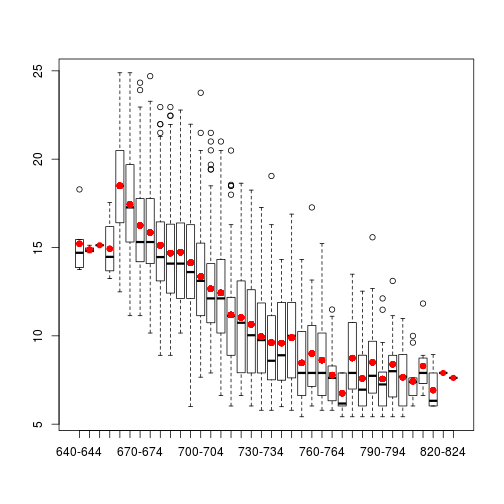
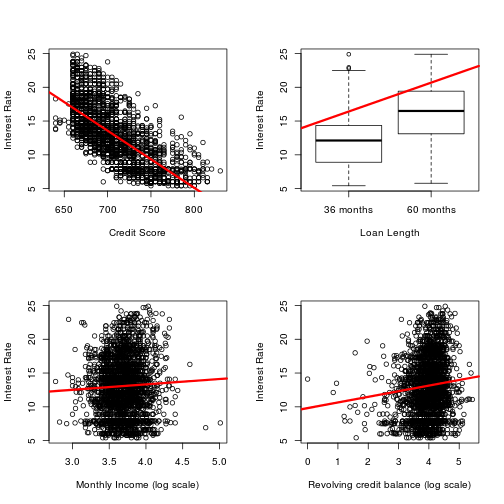

Exploratory analysis
========================================================

### Load libraries


Download the data, read the data in and save the raw data as an RDA file


```r
setwd("/dvt/workspace/r-data-analysis-course/assignment-1/work")
getwd()
```

```
## [1] "/dvt/workspace/r-data-analysis-course/assignment-1/work"
```

```r
download.file("https://spark-public.s3.amazonaws.com/dataanalysis/loansData.csv", 
    destfile = "./data/raw/loansData.csv", method = "curl")
dateDownloaded <- date()
dateDownloaded
```

```
## [1] "Sat Feb 16 21:10:44 2013"
```

```r
loansData <- read.csv("./data/raw/loansData.csv")
save(loansData, dateDownloaded, file = "./data/raw/loansData.rda")
```


### Fix incorrect types

```r
loansData$Interest.Rate <- sapply(loansData$Interest.Rate, function(x) as.numeric(sub("%", 
    "", x)))
loansData$Debt.To.Income.Ratio <- sapply(loansData$Debt.To.Income.Ratio, function(x) as.numeric(sub("%", 
    "", x)))
```


### Look at the data set


```r
str(loansData)
```

```
## 'data.frame':	2500 obs. of  14 variables:
##  $ Amount.Requested              : int  20000 19200 35000 10000 12000 6000 10000 33500 14675 7000 ...
##  $ Amount.Funded.By.Investors    : num  20000 19200 35000 9975 12000 ...
##  $ Interest.Rate                 : num  8.9 12.12 21.98 9.99 11.71 ...
##  $ Loan.Length                   : Factor w/ 2 levels "36 months","60 months": 1 1 2 1 1 1 1 2 1 1 ...
##  $ Loan.Purpose                  : Factor w/ 14 levels "car","credit_card",..: 3 3 3 3 2 10 3 2 2 2 ...
##  $ Debt.To.Income.Ratio          : num  14.9 28.4 23.8 14.3 18.8 ...
##  $ State                         : Factor w/ 46 levels "AK","AL","AR",..: 37 39 5 16 28 7 19 18 5 5 ...
##  $ Home.Ownership                : Factor w/ 5 levels "MORTGAGE","NONE",..: 1 1 1 1 5 4 5 1 5 5 ...
##  $ Monthly.Income                : num  6542 4583 11500 3833 3195 ...
##  $ FICO.Range                    : Factor w/ 38 levels "640-644","645-649",..: 20 16 11 12 12 7 17 14 10 16 ...
##  $ Open.CREDIT.Lines             : int  14 12 14 10 11 17 10 12 9 8 ...
##  $ Revolving.CREDIT.Balance      : int  14272 11140 21977 9346 14469 10391 15957 27874 7246 7612 ...
##  $ Inquiries.in.the.Last.6.Months: int  2 1 1 0 0 2 0 0 1 0 ...
##  $ Employment.Length             : Factor w/ 12 levels "10+ years","< 1 year",..: 2 4 4 7 11 5 1 1 10 5 ...
```

```r
sapply(loansData, summary)
```

```
## $Amount.Requested
##    Min. 1st Qu.  Median    Mean 3rd Qu.    Max. 
##    1000    6000   10000   12400   17000   35000 
## 
## $Amount.Funded.By.Investors
##    Min. 1st Qu.  Median    Mean 3rd Qu.    Max. 
##       0    6000   10000   12000   16000   35000 
## 
## $Interest.Rate
##    Min. 1st Qu.  Median    Mean 3rd Qu.    Max. 
##    5.42   10.20   13.10   13.10   15.80   24.90 
## 
## $Loan.Length
## 36 months 60 months 
##      1952       548 
## 
## $Loan.Purpose
##                car        credit_card debt_consolidation 
##                 50                444               1307 
##        educational   home_improvement              house 
##                 15                152                 20 
##     major_purchase            medical             moving 
##                101                 30                 29 
##              other   renewable_energy     small_business 
##                201                  4                 87 
##           vacation            wedding 
##                 21                 39 
## 
## $Debt.To.Income.Ratio
##    Min. 1st Qu.  Median    Mean 3rd Qu.    Max. 
##    0.00    9.75   15.30   15.40   20.70   34.90 
## 
## $State
##  AK  AL  AR  AZ  CA  CO  CT  DC  DE  FL  GA  HI  IA  IL  IN  KS  KY  LA 
##  11  38  13  46 433  61  50  11   8 169  98  12   1 101   3  21  23  22 
##  MA  MD  MI  MN  MO  MS  MT  NC  NH  NJ  NM  NV  NY  OH  OK  OR  PA  RI 
##  73  68  45  38  33   1   7  64  15  94  13  32 255  71  21  30  96  15 
##  SC  SD  TX  UT  VA  VT  WA  WI  WV  WY 
##  28   4 174  16  78   5  58  26  15   4 
## 
## $Home.Ownership
## MORTGAGE     NONE    OTHER      OWN     RENT 
##     1148        1        5      200     1146 
## 
## $Monthly.Income
##    Min. 1st Qu.  Median    Mean 3rd Qu.    Max.    NA's 
##     588    3500    5000    5690    6800  103000       1 
## 
## $FICO.Range
## 640-644 645-649 650-654 655-659 660-664 665-669 670-674 675-679 680-684 
##       5       3       1       4     125     145     171     166     157 
## 685-689 690-694 695-699 700-704 705-709 710-714 715-719 720-724 725-729 
##     138     140     153     131     134     112      93     114      94 
## 730-734 735-739 740-744 745-749 750-754 755-759 760-764 765-769 770-774 
##      94      65      53      54      61      46      46      36      17 
## 775-779 780-784 785-789 790-794 795-799 800-804 805-809 810-814 815-819 
##      22      28      19      20      13      13      11       8       6 
## 820-824 830-834 
##       1       1 
## 
## $Open.CREDIT.Lines
##    Min. 1st Qu.  Median    Mean 3rd Qu.    Max.    NA's 
##     2.0     7.0     9.0    10.1    13.0    38.0       2 
## 
## $Revolving.CREDIT.Balance
##    Min. 1st Qu.  Median    Mean 3rd Qu.    Max.    NA's 
##       0    5590   11000   15200   18900  271000       2 
## 
## $Inquiries.in.the.Last.6.Months
##    Min. 1st Qu.  Median    Mean 3rd Qu.    Max.    NA's 
##   0.000   0.000   0.000   0.906   1.000   9.000       2 
## 
## $Employment.Length
## 10+ years  < 1 year    1 year   2 years   3 years   4 years   5 years 
##       653       250       177       244       235       192       202 
##   6 years   7 years   8 years   9 years       n/a 
##       163       127       108        72        77
```


### Find out about missing values

```r
sum(is.na(loansData))
```

```
## [1] 7
```

```r
loansData <- loansData[complete.cases(loansData), ]
```


### Explore the suspiscious columns

```r
hd <- hist(loansData$Monthly.Income, breaks = 100)
```

 

```r
print(hd$counts)
```

```
##   [1]   9  95 321 429 474 350 231 197 107  84  50  32  35  23  16   6   5
##  [18]   3  11   4   5   1   2   0   4   0   0   1   0   0   0   0   0   0
##  [35]   0   0   0   0   0   1   0   0   0   0   0   0   0   0   0   0   0
##  [52]   0   0   0   0   0   0   0   0   0   0   0   0   0   1   0   0   0
##  [69]   0   0   0   0   0   0   0   0   0   0   0   0   0   0   0   0   0
##  [86]   0   0   0   0   0   0   0   0   0   0   0   0   0   0   0   0   0
## [103]   1
```

```r
# Monthly needs transformation
hd <- hist(log(loansData$Monthly.Income), breaks = 100)
```

 

```r
max(loansData$Monthly.Income, na.rm = T)
```

```
## [1] 102750
```

There is one monthly income which seems extremely high, probably a mistake?


```r
suspi <- subset(loansData, Monthly.Income == max(loansData$Monthly.Income, na.rm = T))
print(suspi)
```

```
##       Amount.Requested Amount.Funded.By.Investors Interest.Rate
## 54487            33000                      33000          7.62
##       Loan.Length       Loan.Purpose Debt.To.Income.Ratio State
## 54487   36 months debt_consolidation                 0.26    NY
##       Home.Ownership Monthly.Income FICO.Range Open.CREDIT.Lines
## 54487       MORTGAGE         102750    805-809                 7
##       Revolving.CREDIT.Balance Inquiries.in.the.Last.6.Months
## 54487                    95435                              0
##       Employment.Length
## 54487         10+ years
```

```r
suspi$Monthly.Income/suspi$Amount.Funded.By.Investors
```

```
## [1] 3.114
```

The percentage of gross income that goes into paying the debt is small, which indicates that the person may really have a big income. Though some others do have smaller ratios.


## Exploratory analysis

### Make some univariate plots/summaries


```r
loansData$FICO <- sapply(as.character(loansData$FICO.Range), function(s) as.numeric(substr(s, 
    0, 3)))

# interest rate seems interesting
hist(loansData$Interest.Rate, breaks = 100)
```

 

```r
# as if there were two distributions...
hist(log10(loansData$Interest.Rate), breaks = 100, prob = T)
```

 

```r

# this is interesting, there is a 'required' minimum
hist(loansData$FICO, breaks = 100)
```

 

```r
# log transformation doesnt change it (so it is cutoff)
hist(log(loansData$FICO), breaks = 100)
```

 

```r

# is this increasing lineary? it seems like...
quantile(loansData$FICO, na.rm = T, probs = seq(0, 1, 0.05))
```

```
##   0%   5%  10%  15%  20%  25%  30%  35%  40%  45%  50%  55%  60%  65%  70% 
##  640  660  665  670  675  680  680  685  690  695  700  705  710  715  720 
##  75%  80%  85%  90%  95% 100% 
##  725  735  745  755  775  830
```

```r

# investors obviously prefer borrowers who don't have too high ratio of
# indebtness, but it is not too strong
hist(loansData$Debt.To.Income.Ratio)
```

 

```r

# and few credit lines
hist(loansData$Open.CREDIT.Lines, breaks = 100)
```

 

```r
hist(as.numeric(cut(loansData$Open.CREDIT.Lines, breaks = seq(0, 30, 1))))
```

 

```r

# what was requrested was granted, hmm....
par(mfcol = c(2, 1))
par(mar = c(2.5, 2.5, 1.6, 1.1), mgp = c(1.5, 0.5, 0))
hist(loansData$Amount.Requested, breaks = 100)
hist(loansData$Amount.Funded.By.Investors, breaks = 100)
```

 

```r
par(mfcol = c(1, 1))

# my understanding is that only borrowers who do not already own too much,
# are welcomed TODO: look at the relationship between CB ~ FICO
quantile(loansData$Revolving.CREDIT.Balance, na.rm = T, probs = seq(0, 1, 0.05))
```

```
##       0%       5%      10%      15%      20%      25%      30%      35% 
##      0.0    917.7   2299.1   3531.4   4645.2   5585.8   6563.9   7495.7 
##      40%      45%      50%      55%      60%      65%      70%      75% 
##   8576.6   9718.2  10962.0  12099.6  13494.2  14835.1  16664.2  18888.8 
##      80%      85%      90%      95%     100% 
##  21527.2  25445.3  30268.1  40788.8 270800.0
```

```r
hist(loansData$Revolving.CREDIT.Balance, breaks = 100)
```

 

```r
# needs transformation...
hist(log(loansData$Revolving.CREDIT.Balance), breaks = 100)
```

 

```r

# TODO: has employment have any effect on the interest?
hist(as.numeric(loansData$Employment.Length), breaks = 100)
```

 

```r


quantile(loansData$Interest.Rate)
```

```
##    0%   25%   50%   75%  100% 
##  5.42 10.16 13.11 15.80 24.89
```

```r
quantile(loansData$Monthly.Income, na.rm = T, probs = seq(0, 1, 0.05))
```

```
##       0%       5%      10%      15%      20%      25%      30%      35% 
##    588.5   2165.7   2600.0   2916.7   3250.0   3500.0   3750.0   4166.7 
##      40%      45%      50%      55%      60%      65%      70%      75% 
##   4333.3   4583.3   5000.0   5166.7   5430.9   5833.3   6250.0   6800.0 
##      80%      85%      90%      95%     100% 
##   7500.0   8333.3   9261.5  11666.7 102750.0
```

```r

```


So it seems that FICO must be > 650 for the loan to be approved. And we have got some terms to check for relations


### Check out relationship with Interest Rate (IR)

```r
ir <- loansData$Interest.Rate
par(las = 3)
par(mar = c(6, 2, 1, 1))
boxplot(ir ~ loansData$Loan.Purpose)
```

 

```r
boxplot(ir ~ loansData$Home.Ownership)
```

 

```r

# a linear relationn between IR an FICO?
boxplot(ir ~ loansData$FICO.Range)
```

 

```r

# no relation between IR and Employment length
boxplot(ir ~ loansData$Employment.Length)
```

 

```r

# IR clearly depends on the length (which is logical, but it is
# interesting that shorter terms have lower IR)
boxplot(ir ~ loansData$Loan.Length)
```

 

```r

# am i seeing that poorer will get higher IRs? and richer pay less?
boxplot(ir ~ cut(loansData$Debt.To.Income.Ratio, breaks = seq(0, max(loansData$Debt.To.Income.Ratio, 
    na.rm = T), max(loansData$Debt.To.Income.Ratio, na.rm = T)/20)))
```

 

```r
# different cut
boxplot(ir ~ cut(loansData$Debt.To.Income.Ratio, breaks = 10))
```

 

```r

# there seems to be no relation with CB
boxplot(ir ~ cut(loansData$Revolving.CREDIT.Balance, breaks = 20))
```

 

```r

# this might be just reflection of the fact that 'poorer' people have
# worse credit ratings, need more money and ask moore often for credit
# ratings, but look at how many outliers are for 0'th group
boxplot(ir ~ loansData$Inquiries.in.the.Last.6.Months)
```

 

```r

# finally, IR may depend on the ammount requested
plot(y = loansData$Interest.Rate, x = loansData$Amount.Requested, log = "xy")
```

 

```r

# also Dept to income ratio may represent a linear relationship
plot(y = loansData$Interest.Rate, x = loansData$Debt.To.Income.Ratio, log = "y")
```

 

```r

# but there is no relationship with monthly income
plot(y = loansData$Interest.Rate, x = loansData$Monthly.Income, log = "xy")
```

 

```r
lm1 <- lm(log(ir) ~ log(loansData$Monthly.Income))
summary(lm1)
```

```
## 
## Call:
## lm(formula = log(ir) ~ log(loansData$Monthly.Income))
## 
## Residuals:
##     Min      1Q  Median      3Q     Max 
## -0.8353 -0.2038  0.0554  0.2447  0.7016 
## 
## Coefficients:
##                               Estimate Std. Error t value Pr(>|t|)    
## (Intercept)                     2.3996     0.1106   21.70   <2e-16 ***
## log(loansData$Monthly.Income)   0.0137     0.0130    1.05     0.29    
## ---
## Signif. codes:  0 '***' 0.001 '**' 0.01 '*' 0.05 '.' 0.1 ' ' 1 
## 
## Residual standard error: 0.339 on 2496 degrees of freedom
## Multiple R-squared: 0.000443,	Adjusted R-squared: 4.25e-05 
## F-statistic: 1.11 on 1 and 2496 DF,  p-value: 0.293
```

```r

# but there might be with the Revolving credit balance
plot(y = log(loansData$Interest.Rate + 1), x = log(loansData$Revolving.CREDIT.Balance + 
    1))
```

 

```r

lm1 <- lm(log(loansData$Interest.Rate + 1) ~ log(loansData$Revolving.CREDIT.Balance + 
    1))
summary(lm1)
```

```
## 
## Call:
## lm(formula = log(loansData$Interest.Rate + 1) ~ log(loansData$Revolving.CREDIT.Balance + 
##     1))
## 
## Residuals:
##     Min      1Q  Median      3Q     Max 
## -0.7767 -0.1990  0.0403  0.2211  0.7892 
## 
## Coefficients:
##                                             Estimate Std. Error t value
## (Intercept)                                  2.35103    0.03546   66.30
## log(loansData$Revolving.CREDIT.Balance + 1)  0.02732    0.00387    7.06
##                                             Pr(>|t|)    
## (Intercept)                                  < 2e-16 ***
## log(loansData$Revolving.CREDIT.Balance + 1)  2.1e-12 ***
## ---
## Signif. codes:  0 '***' 0.001 '**' 0.01 '*' 0.05 '.' 0.1 ' ' 1 
## 
## Residual standard error: 0.308 on 2496 degrees of freedom
## Multiple R-squared: 0.0196,	Adjusted R-squared: 0.0192 
## F-statistic: 49.9 on 1 and 2496 DF,  p-value: 2.14e-12
```


## Modeling


## Fit a basic model relating IR to other vars, namely

 * FICO (maybe cut by quantiles)
 * Debt.To.Income.Ratio
 * Open.CREDIT.Lines [found not interesting]
 * Credit.Balance
 * Loan.Length
 * Ownership (but only for the category NONE?)
 * Purpose (especially: educational, car, renevable_energy)

TODO: look at relation between Credit.Balance ~ FICO


```r

# FICO Good!
ir <- loansData$Interest.Rate
lmFico <- lm(ir ~ loansData$FICO.Range)
summary(lmFico)
```

```
## 
## Call:
## lm(formula = ir ~ loansData$FICO.Range)
## 
## Residuals:
##    Min     1Q Median     3Q    Max 
## -8.147 -2.037 -0.493  1.668 10.403 
## 
## Coefficients:
##                             Estimate Std. Error t value Pr(>|t|)    
## (Intercept)                  15.2120     1.2696   11.98  < 2e-16 ***
## loansData$FICO.Range645-649  -0.3287     2.0732   -0.16  0.87405    
## loansData$FICO.Range650-654  -0.0820     3.1098   -0.03  0.97897    
## loansData$FICO.Range655-659  -0.2820     1.9044   -0.15  0.88229    
## loansData$FICO.Range660-664   3.2805     1.2947    2.53  0.01135 *  
## loansData$FICO.Range665-669   2.2361     1.2913    1.73  0.08346 .  
## loansData$FICO.Range670-674   1.0365     1.2880    0.80  0.42106    
## loansData$FICO.Range675-679   0.6427     1.2886    0.50  0.61798    
## loansData$FICO.Range680-684  -0.0853     1.2896   -0.07  0.94726    
## loansData$FICO.Range685-689  -0.5252     1.2925   -0.41  0.68453    
## loansData$FICO.Range690-694  -0.4799     1.2920   -0.37  0.71034    
## loansData$FICO.Range695-699  -1.0651     1.2902   -0.83  0.40912    
## loansData$FICO.Range700-704  -1.8551     1.2936   -1.43  0.15167    
## loansData$FICO.Range705-709  -2.5521     1.2930   -1.97  0.04852 *  
## loansData$FICO.Range710-714  -2.7789     1.2976   -2.14  0.03233 *  
## loansData$FICO.Range715-719  -4.0301     1.3033   -3.09  0.00201 ** 
## loansData$FICO.Range720-724  -4.1762     1.2971   -3.22  0.00130 ** 
## loansData$FICO.Range725-729  -4.5590     1.3029   -3.50  0.00048 ***
## loansData$FICO.Range730-734  -5.2558     1.3029   -4.03  5.7e-05 ***
## loansData$FICO.Range735-739  -5.5885     1.3175   -4.24  2.3e-05 ***
## loansData$FICO.Range740-744  -5.6197     1.3281   -4.23  2.4e-05 ***
## loansData$FICO.Range745-749  -5.3103     1.3271   -4.00  6.5e-05 ***
## loansData$FICO.Range750-754  -6.7443     1.3206   -5.11  3.5e-07 ***
## loansData$FICO.Range755-759  -6.2159     1.3368   -4.65  3.5e-06 ***
## loansData$FICO.Range760-764  -6.5844     1.3368   -4.93  9.0e-07 ***
## loansData$FICO.Range765-769  -7.4287     1.3549   -5.48  4.6e-08 ***
## loansData$FICO.Range770-774  -8.4591     1.4443   -5.86  5.3e-09 ***
## loansData$FICO.Range775-779  -6.4679     1.4065   -4.60  4.5e-06 ***
## loansData$FICO.Range780-784  -7.6227     1.3783   -5.53  3.5e-08 ***
## loansData$FICO.Range785-789  -6.7141     1.4269   -4.71  2.7e-06 ***
## loansData$FICO.Range790-794  -7.6515     1.4194   -5.39  7.7e-08 ***
## loansData$FICO.Range795-799  -6.8205     1.4939   -4.57  5.2e-06 ***
## loansData$FICO.Range800-804  -7.5562     1.5111   -5.00  6.1e-07 ***
## loansData$FICO.Range805-809  -7.7856     1.5312   -5.08  4.0e-07 ***
## loansData$FICO.Range810-814  -6.9183     1.6184   -4.27  2.0e-05 ***
## loansData$FICO.Range815-819  -8.2870     1.7190   -4.82  1.5e-06 ***
## loansData$FICO.Range820-824  -7.3120     3.1098   -2.35  0.01879 *  
## loansData$FICO.Range830-834  -7.5920     3.1098   -2.44  0.01470 *  
## ---
## Signif. codes:  0 '***' 0.001 '**' 0.01 '*' 0.05 '.' 0.1 ' ' 1 
## 
## Residual standard error: 2.84 on 2460 degrees of freedom
## Multiple R-squared: 0.545,	Adjusted R-squared: 0.538 
## F-statistic: 79.7 on 37 and 2460 DF,  p-value: <2e-16
```

```r

# much bettter! select the median value as a base point
lmFico <- lm(ir ~ relevel(loansData$FICO.Range, ref = "700-704"))
summary(lmFico)
```

```
## 
## Call:
## lm(formula = ir ~ relevel(loansData$FICO.Range, ref = "700-704"))
## 
## Residuals:
##    Min     1Q Median     3Q    Max 
## -8.147 -2.037 -0.493  1.668 10.403 
## 
## Coefficients:
##                                                       Estimate Std. Error
## (Intercept)                                             13.357      0.248
## relevel(loansData$FICO.Range, ref = "700-704")640-644    1.855      1.294
## relevel(loansData$FICO.Range, ref = "700-704")645-649    1.526      1.658
## relevel(loansData$FICO.Range, ref = "700-704")650-654    1.773      2.850
## relevel(loansData$FICO.Range, ref = "700-704")655-659    1.573      1.441
## relevel(loansData$FICO.Range, ref = "700-704")660-664    5.136      0.355
## relevel(loansData$FICO.Range, ref = "700-704")665-669    4.091      0.342
## relevel(loansData$FICO.Range, ref = "700-704")670-674    2.892      0.330
## relevel(loansData$FICO.Range, ref = "700-704")675-679    2.498      0.332
## relevel(loansData$FICO.Range, ref = "700-704")680-684    1.770      0.336
## relevel(loansData$FICO.Range, ref = "700-704")685-689    1.330      0.347
## relevel(loansData$FICO.Range, ref = "700-704")690-694    1.375      0.345
## relevel(loansData$FICO.Range, ref = "700-704")695-699    0.790      0.338
## relevel(loansData$FICO.Range, ref = "700-704")705-709   -0.697      0.349
## relevel(loansData$FICO.Range, ref = "700-704")710-714   -0.924      0.365
## relevel(loansData$FICO.Range, ref = "700-704")715-719   -2.175      0.385
## relevel(loansData$FICO.Range, ref = "700-704")720-724   -2.321      0.364
## relevel(loansData$FICO.Range, ref = "700-704")725-729   -2.704      0.384
## relevel(loansData$FICO.Range, ref = "700-704")730-734   -3.401      0.384
## relevel(loansData$FICO.Range, ref = "700-704")735-739   -3.733      0.431
## relevel(loansData$FICO.Range, ref = "700-704")740-744   -3.765      0.462
## relevel(loansData$FICO.Range, ref = "700-704")745-749   -3.455      0.459
## relevel(loansData$FICO.Range, ref = "700-704")750-754   -4.889      0.440
## relevel(loansData$FICO.Range, ref = "700-704")755-759   -4.361      0.487
## relevel(loansData$FICO.Range, ref = "700-704")760-764   -4.729      0.487
## relevel(loansData$FICO.Range, ref = "700-704")765-769   -5.574      0.534
## relevel(loansData$FICO.Range, ref = "700-704")770-774   -6.604      0.732
## relevel(loansData$FICO.Range, ref = "700-704")775-779   -4.613      0.654
## relevel(loansData$FICO.Range, ref = "700-704")780-784   -5.768      0.591
## relevel(loansData$FICO.Range, ref = "700-704")785-789   -4.859      0.697
## relevel(loansData$FICO.Range, ref = "700-704")790-794   -5.796      0.682
## relevel(loansData$FICO.Range, ref = "700-704")795-799   -4.965      0.826
## relevel(loansData$FICO.Range, ref = "700-704")800-804   -5.701      0.856
## relevel(loansData$FICO.Range, ref = "700-704")805-809   -5.931      0.891
## relevel(loansData$FICO.Range, ref = "700-704")810-814   -5.063      1.034
## relevel(loansData$FICO.Range, ref = "700-704")815-819   -6.432      1.185
## relevel(loansData$FICO.Range, ref = "700-704")820-824   -5.457      2.850
## relevel(loansData$FICO.Range, ref = "700-704")830-834   -5.737      2.850
##                                                       t value Pr(>|t|)    
## (Intercept)                                             53.85  < 2e-16 ***
## relevel(loansData$FICO.Range, ref = "700-704")640-644    1.43  0.15167    
## relevel(loansData$FICO.Range, ref = "700-704")645-649    0.92  0.35722    
## relevel(loansData$FICO.Range, ref = "700-704")650-654    0.62  0.53385    
## relevel(loansData$FICO.Range, ref = "700-704")655-659    1.09  0.27505    
## relevel(loansData$FICO.Range, ref = "700-704")660-664   14.47  < 2e-16 ***
## relevel(loansData$FICO.Range, ref = "700-704")665-669   11.96  < 2e-16 ***
## relevel(loansData$FICO.Range, ref = "700-704")670-674    8.77  < 2e-16 ***
## relevel(loansData$FICO.Range, ref = "700-704")675-679    7.53  7.1e-14 ***
## relevel(loansData$FICO.Range, ref = "700-704")680-684    5.27  1.5e-07 ***
## relevel(loansData$FICO.Range, ref = "700-704")685-689    3.83  0.00013 ***
## relevel(loansData$FICO.Range, ref = "700-704")690-694    3.99  6.9e-05 ***
## relevel(loansData$FICO.Range, ref = "700-704")695-699    2.34  0.01948 *  
## relevel(loansData$FICO.Range, ref = "700-704")705-709   -2.00  0.04579 *  
## relevel(loansData$FICO.Range, ref = "700-704")710-714   -2.53  0.01152 *  
## relevel(loansData$FICO.Range, ref = "700-704")715-719   -5.65  1.8e-08 ***
## relevel(loansData$FICO.Range, ref = "700-704")720-724   -6.38  2.1e-10 ***
## relevel(loansData$FICO.Range, ref = "700-704")725-729   -7.05  2.4e-12 ***
## relevel(loansData$FICO.Range, ref = "700-704")730-734   -8.86  < 2e-16 ***
## relevel(loansData$FICO.Range, ref = "700-704")735-739   -8.67  < 2e-16 ***
## relevel(loansData$FICO.Range, ref = "700-704")740-744   -8.15  5.9e-16 ***
## relevel(loansData$FICO.Range, ref = "700-704")745-749   -7.53  7.3e-14 ***
## relevel(loansData$FICO.Range, ref = "700-704")750-754  -11.11  < 2e-16 ***
## relevel(loansData$FICO.Range, ref = "700-704")755-759   -8.96  < 2e-16 ***
## relevel(loansData$FICO.Range, ref = "700-704")760-764   -9.72  < 2e-16 ***
## relevel(loansData$FICO.Range, ref = "700-704")765-769  -10.43  < 2e-16 ***
## relevel(loansData$FICO.Range, ref = "700-704")770-774   -9.02  < 2e-16 ***
## relevel(loansData$FICO.Range, ref = "700-704")775-779   -7.05  2.3e-12 ***
## relevel(loansData$FICO.Range, ref = "700-704")780-784   -9.76  < 2e-16 ***
## relevel(loansData$FICO.Range, ref = "700-704")785-789   -6.97  4.0e-12 ***
## relevel(loansData$FICO.Range, ref = "700-704")790-794   -8.51  < 2e-16 ***
## relevel(loansData$FICO.Range, ref = "700-704")795-799   -6.01  2.1e-09 ***
## relevel(loansData$FICO.Range, ref = "700-704")800-804   -6.66  3.4e-11 ***
## relevel(loansData$FICO.Range, ref = "700-704")805-809   -6.65  3.5e-11 ***
## relevel(loansData$FICO.Range, ref = "700-704")810-814   -4.90  1.0e-06 ***
## relevel(loansData$FICO.Range, ref = "700-704")815-819   -5.43  6.3e-08 ***
## relevel(loansData$FICO.Range, ref = "700-704")820-824   -1.91  0.05562 .  
## relevel(loansData$FICO.Range, ref = "700-704")830-834   -2.01  0.04421 *  
## ---
## Signif. codes:  0 '***' 0.001 '**' 0.01 '*' 0.05 '.' 0.1 ' ' 1 
## 
## Residual standard error: 2.84 on 2460 degrees of freedom
## Multiple R-squared: 0.545,	Adjusted R-squared: 0.538 
## F-statistic: 79.7 on 37 and 2460 DF,  p-value: <2e-16
```

```r

# Debt.To.Income.Ratio Good!
lmDebRatio <- lm(ir ~ cut(loansData$Debt.To.Income.Ratio, breaks = 20))
summary(lmDebRatio)
```

```
## 
## Call:
## lm(formula = ir ~ cut(loansData$Debt.To.Income.Ratio, breaks = 20))
## 
## Residuals:
##    Min     1Q Median     3Q    Max 
##  -9.65  -3.06  -0.07   2.62  12.69 
## 
## Coefficients:
##                                                             Estimate
## (Intercept)                                                  11.5109
## cut(loansData$Debt.To.Income.Ratio, breaks = 20)(1.71,3.46]   0.0761
## cut(loansData$Debt.To.Income.Ratio, breaks = 20)(3.46,5.21]   0.7097
## cut(loansData$Debt.To.Income.Ratio, breaks = 20)(5.21,6.96]   0.2995
## cut(loansData$Debt.To.Income.Ratio, breaks = 20)(6.96,8.71]   0.4964
## cut(loansData$Debt.To.Income.Ratio, breaks = 20)(8.71,10.5]   1.4933
## cut(loansData$Debt.To.Income.Ratio, breaks = 20)(10.5,12.2]   1.6693
## cut(loansData$Debt.To.Income.Ratio, breaks = 20)(12.2,14]     1.4052
## cut(loansData$Debt.To.Income.Ratio, breaks = 20)(14,15.7]     1.5545
## cut(loansData$Debt.To.Income.Ratio, breaks = 20)(15.7,17.5]   1.7367
## cut(loansData$Debt.To.Income.Ratio, breaks = 20)(17.5,19.2]   1.7599
## cut(loansData$Debt.To.Income.Ratio, breaks = 20)(19.2,21]     1.7414
## cut(loansData$Debt.To.Income.Ratio, breaks = 20)(21,22.7]     1.5990
## cut(loansData$Debt.To.Income.Ratio, breaks = 20)(22.7,24.5]   2.5364
## cut(loansData$Debt.To.Income.Ratio, breaks = 20)(24.5,26.2]   2.5759
## cut(loansData$Debt.To.Income.Ratio, breaks = 20)(26.2,27.9]   2.6198
## cut(loansData$Debt.To.Income.Ratio, breaks = 20)(27.9,29.7]   2.8198
## cut(loansData$Debt.To.Income.Ratio, breaks = 20)(29.7,31.4]   3.4411
## cut(loansData$Debt.To.Income.Ratio, breaks = 20)(31.4,33.2]   3.3468
## cut(loansData$Debt.To.Income.Ratio, breaks = 20)(33.2,34.9]   4.1687
##                                                             Std. Error
## (Intercept)                                                     0.5457
## cut(loansData$Debt.To.Income.Ratio, breaks = 20)(1.71,3.46]     0.7005
## cut(loansData$Debt.To.Income.Ratio, breaks = 20)(3.46,5.21]     0.6863
## cut(loansData$Debt.To.Income.Ratio, breaks = 20)(5.21,6.96]     0.6637
## cut(loansData$Debt.To.Income.Ratio, breaks = 20)(6.96,8.71]     0.6382
## cut(loansData$Debt.To.Income.Ratio, breaks = 20)(8.71,10.5]     0.6279
## cut(loansData$Debt.To.Income.Ratio, breaks = 20)(10.5,12.2]     0.6197
## cut(loansData$Debt.To.Income.Ratio, breaks = 20)(12.2,14]       0.6226
## cut(loansData$Debt.To.Income.Ratio, breaks = 20)(14,15.7]       0.6129
## cut(loansData$Debt.To.Income.Ratio, breaks = 20)(15.7,17.5]     0.6121
## cut(loansData$Debt.To.Income.Ratio, breaks = 20)(17.5,19.2]     0.6207
## cut(loansData$Debt.To.Income.Ratio, breaks = 20)(19.2,21]       0.6197
## cut(loansData$Debt.To.Income.Ratio, breaks = 20)(21,22.7]       0.6283
## cut(loansData$Debt.To.Income.Ratio, breaks = 20)(22.7,24.5]     0.6619
## cut(loansData$Debt.To.Income.Ratio, breaks = 20)(24.5,26.2]     0.7070
## cut(loansData$Debt.To.Income.Ratio, breaks = 20)(26.2,27.9]     0.7305
## cut(loansData$Debt.To.Income.Ratio, breaks = 20)(27.9,29.7]     0.7620
## cut(loansData$Debt.To.Income.Ratio, breaks = 20)(29.7,31.4]     0.9883
## cut(loansData$Debt.To.Income.Ratio, breaks = 20)(31.4,33.2]     0.9750
## cut(loansData$Debt.To.Income.Ratio, breaks = 20)(33.2,34.9]     0.9750
##                                                             t value
## (Intercept)                                                   21.09
## cut(loansData$Debt.To.Income.Ratio, breaks = 20)(1.71,3.46]    0.11
## cut(loansData$Debt.To.Income.Ratio, breaks = 20)(3.46,5.21]    1.03
## cut(loansData$Debt.To.Income.Ratio, breaks = 20)(5.21,6.96]    0.45
## cut(loansData$Debt.To.Income.Ratio, breaks = 20)(6.96,8.71]    0.78
## cut(loansData$Debt.To.Income.Ratio, breaks = 20)(8.71,10.5]    2.38
## cut(loansData$Debt.To.Income.Ratio, breaks = 20)(10.5,12.2]    2.69
## cut(loansData$Debt.To.Income.Ratio, breaks = 20)(12.2,14]      2.26
## cut(loansData$Debt.To.Income.Ratio, breaks = 20)(14,15.7]      2.54
## cut(loansData$Debt.To.Income.Ratio, breaks = 20)(15.7,17.5]    2.84
## cut(loansData$Debt.To.Income.Ratio, breaks = 20)(17.5,19.2]    2.84
## cut(loansData$Debt.To.Income.Ratio, breaks = 20)(19.2,21]      2.81
## cut(loansData$Debt.To.Income.Ratio, breaks = 20)(21,22.7]      2.54
## cut(loansData$Debt.To.Income.Ratio, breaks = 20)(22.7,24.5]    3.83
## cut(loansData$Debt.To.Income.Ratio, breaks = 20)(24.5,26.2]    3.64
## cut(loansData$Debt.To.Income.Ratio, breaks = 20)(26.2,27.9]    3.59
## cut(loansData$Debt.To.Income.Ratio, breaks = 20)(27.9,29.7]    3.70
## cut(loansData$Debt.To.Income.Ratio, breaks = 20)(29.7,31.4]    3.48
## cut(loansData$Debt.To.Income.Ratio, breaks = 20)(31.4,33.2]    3.43
## cut(loansData$Debt.To.Income.Ratio, breaks = 20)(33.2,34.9]    4.28
##                                                             Pr(>|t|)    
## (Intercept)                                                  < 2e-16 ***
## cut(loansData$Debt.To.Income.Ratio, breaks = 20)(1.71,3.46]  0.91355    
## cut(loansData$Debt.To.Income.Ratio, breaks = 20)(3.46,5.21]  0.30117    
## cut(loansData$Debt.To.Income.Ratio, breaks = 20)(5.21,6.96]  0.65178    
## cut(loansData$Debt.To.Income.Ratio, breaks = 20)(6.96,8.71]  0.43675    
## cut(loansData$Debt.To.Income.Ratio, breaks = 20)(8.71,10.5]  0.01747 *  
## cut(loansData$Debt.To.Income.Ratio, breaks = 20)(10.5,12.2]  0.00711 ** 
## cut(loansData$Debt.To.Income.Ratio, breaks = 20)(12.2,14]    0.02410 *  
## cut(loansData$Debt.To.Income.Ratio, breaks = 20)(14,15.7]    0.01127 *  
## cut(loansData$Debt.To.Income.Ratio, breaks = 20)(15.7,17.5]  0.00458 ** 
## cut(loansData$Debt.To.Income.Ratio, breaks = 20)(17.5,19.2]  0.00462 ** 
## cut(loansData$Debt.To.Income.Ratio, breaks = 20)(19.2,21]    0.00499 ** 
## cut(loansData$Debt.To.Income.Ratio, breaks = 20)(21,22.7]    0.01100 *  
## cut(loansData$Debt.To.Income.Ratio, breaks = 20)(22.7,24.5]  0.00013 ***
## cut(loansData$Debt.To.Income.Ratio, breaks = 20)(24.5,26.2]  0.00027 ***
## cut(loansData$Debt.To.Income.Ratio, breaks = 20)(26.2,27.9]  0.00034 ***
## cut(loansData$Debt.To.Income.Ratio, breaks = 20)(27.9,29.7]  0.00022 ***
## cut(loansData$Debt.To.Income.Ratio, breaks = 20)(29.7,31.4]  0.00051 ***
## cut(loansData$Debt.To.Income.Ratio, breaks = 20)(31.4,33.2]  0.00061 ***
## cut(loansData$Debt.To.Income.Ratio, breaks = 20)(33.2,34.9]    2e-05 ***
## ---
## Signif. codes:  0 '***' 0.001 '**' 0.01 '*' 0.05 '.' 0.1 ' ' 1 
## 
## Residual standard error: 4.12 on 2478 degrees of freedom
## Multiple R-squared: 0.035,	Adjusted R-squared: 0.0276 
## F-statistic: 4.72 on 19 and 2478 DF,  p-value: 6.21e-11
```

```r


# maybe useful - but should be alredy inside FICO
lmOcr <- lm(ir ~ cut(loansData$Open.CREDIT.Lines, breaks = 10))
summary(lmOcr)
```

```
## 
## Call:
## lm(formula = ir ~ cut(loansData$Open.CREDIT.Lines, breaks = 10))
## 
## Residuals:
##    Min     1Q Median     3Q    Max 
## -8.755 -3.052 -0.102  2.689 11.678 
## 
## Coefficients:
##                                                          Estimate
## (Intercept)                                               13.1838
## cut(loansData$Open.CREDIT.Lines, breaks = 10)(5.57,9.18]  -0.5628
## cut(loansData$Open.CREDIT.Lines, breaks = 10)(9.18,12.8]   0.0281
## cut(loansData$Open.CREDIT.Lines, breaks = 10)(12.8,16.4]   0.1329
## cut(loansData$Open.CREDIT.Lines, breaks = 10)(16.4,20]     0.1279
## cut(loansData$Open.CREDIT.Lines, breaks = 10)(20,23.6]     1.6015
## cut(loansData$Open.CREDIT.Lines, breaks = 10)(23.6,27.2]   4.3833
## cut(loansData$Open.CREDIT.Lines, breaks = 10)(30.8,34.4]   2.3162
## cut(loansData$Open.CREDIT.Lines, breaks = 10)(34.4,38]     7.5762
##                                                          Std. Error
## (Intercept)                                                  0.2239
## cut(loansData$Open.CREDIT.Lines, breaks = 10)(5.57,9.18]     0.2613
## cut(loansData$Open.CREDIT.Lines, breaks = 10)(9.18,12.8]     0.2879
## cut(loansData$Open.CREDIT.Lines, breaks = 10)(12.8,16.4]     0.2961
## cut(loansData$Open.CREDIT.Lines, breaks = 10)(16.4,20]       0.3953
## cut(loansData$Open.CREDIT.Lines, breaks = 10)(20,23.6]       0.6574
## cut(loansData$Open.CREDIT.Lines, breaks = 10)(23.6,27.2]     1.1306
## cut(loansData$Open.CREDIT.Lines, breaks = 10)(30.8,34.4]     2.9407
## cut(loansData$Open.CREDIT.Lines, breaks = 10)(34.4,38]       2.9407
##                                                          t value Pr(>|t|)
## (Intercept)                                                58.88  < 2e-16
## cut(loansData$Open.CREDIT.Lines, breaks = 10)(5.57,9.18]   -2.15  0.03135
## cut(loansData$Open.CREDIT.Lines, breaks = 10)(9.18,12.8]    0.10  0.92237
## cut(loansData$Open.CREDIT.Lines, breaks = 10)(12.8,16.4]    0.45  0.65359
## cut(loansData$Open.CREDIT.Lines, breaks = 10)(16.4,20]      0.32  0.74635
## cut(loansData$Open.CREDIT.Lines, breaks = 10)(20,23.6]      2.44  0.01492
## cut(loansData$Open.CREDIT.Lines, breaks = 10)(23.6,27.2]    3.88  0.00011
## cut(loansData$Open.CREDIT.Lines, breaks = 10)(30.8,34.4]    0.79  0.43099
## cut(loansData$Open.CREDIT.Lines, breaks = 10)(34.4,38]      2.58  0.01004
##                                                             
## (Intercept)                                              ***
## cut(loansData$Open.CREDIT.Lines, breaks = 10)(5.57,9.18] *  
## cut(loansData$Open.CREDIT.Lines, breaks = 10)(9.18,12.8]    
## cut(loansData$Open.CREDIT.Lines, breaks = 10)(12.8,16.4]    
## cut(loansData$Open.CREDIT.Lines, breaks = 10)(16.4,20]      
## cut(loansData$Open.CREDIT.Lines, breaks = 10)(20,23.6]   *  
## cut(loansData$Open.CREDIT.Lines, breaks = 10)(23.6,27.2] ***
## cut(loansData$Open.CREDIT.Lines, breaks = 10)(30.8,34.4]    
## cut(loansData$Open.CREDIT.Lines, breaks = 10)(34.4,38]   *  
## ---
## Signif. codes:  0 '***' 0.001 '**' 0.01 '*' 0.05 '.' 0.1 ' ' 1 
## 
## Residual standard error: 4.15 on 2489 degrees of freedom
## Multiple R-squared: 0.0181,	Adjusted R-squared: 0.0149 
## F-statistic: 5.73 on 8 and 2489 DF,  p-value: 2.94e-07
```

```r
confint(lmOcr)
```

```
##                                                            2.5 %   97.5 %
## (Intercept)                                              12.7448 13.62290
## cut(loansData$Open.CREDIT.Lines, breaks = 10)(5.57,9.18] -1.0753 -0.05041
## cut(loansData$Open.CREDIT.Lines, breaks = 10)(9.18,12.8] -0.5365  0.59259
## cut(loansData$Open.CREDIT.Lines, breaks = 10)(12.8,16.4] -0.4477  0.71352
## cut(loansData$Open.CREDIT.Lines, breaks = 10)(16.4,20]   -0.6473  0.90306
## cut(loansData$Open.CREDIT.Lines, breaks = 10)(20,23.6]    0.3123  2.89069
## cut(loansData$Open.CREDIT.Lines, breaks = 10)(23.6,27.2]  2.1662  6.60038
## cut(loansData$Open.CREDIT.Lines, breaks = 10)(30.8,34.4] -3.4503  8.08258
## cut(loansData$Open.CREDIT.Lines, breaks = 10)(34.4,38]    1.8097 13.34258
```

```r

# definitely incorporate Loan.Length
lmLen <- lm(ir ~ loansData$Loan.Length)
summary(lmLen)
```

```
## 
## Call:
## lm(formula = ir ~ loansData$Loan.Length)
## 
## Residuals:
##     Min      1Q  Median      3Q     Max 
## -10.617  -3.233  -0.013   2.517  12.757 
## 
## Coefficients:
##                                Estimate Std. Error t value Pr(>|t|)    
## (Intercept)                     12.1326     0.0857   141.5   <2e-16 ***
## loansData$Loan.Length60 months   4.2749     0.1830    23.4   <2e-16 ***
## ---
## Signif. codes:  0 '***' 0.001 '**' 0.01 '*' 0.05 '.' 0.1 ' ' 1 
## 
## Residual standard error: 3.79 on 2496 degrees of freedom
## Multiple R-squared: 0.179,	Adjusted R-squared: 0.179 
## F-statistic:  546 on 1 and 2496 DF,  p-value: <2e-16
```

```r

# not sure, shall we?
levels(loansData$Home.Ownership)
```

```
## [1] "MORTGAGE" "NONE"     "OTHER"    "OWN"      "RENT"
```

```r
lmHome <- lm(ir ~ loansData$Home.Ownership)
summary(lmHome)
```

```
## 
## Call:
## lm(formula = ir ~ loansData$Home.Ownership)
## 
## Residuals:
##    Min     1Q Median     3Q    Max 
## -7.996 -2.981 -0.214  2.569 12.149 
## 
## Coefficients:
##                               Estimate Std. Error t value Pr(>|t|)    
## (Intercept)                     12.741      0.123  103.63  < 2e-16 ***
## loansData$Home.OwnershipOTHER    3.297      1.867    1.77  0.07753 .  
## loansData$Home.OwnershipOWN      0.165      0.319    0.52  0.60543    
## loansData$Home.OwnershipRENT     0.675      0.174    3.88  0.00011 ***
## ---
## Signif. codes:  0 '***' 0.001 '**' 0.01 '*' 0.05 '.' 0.1 ' ' 1 
## 
## Residual standard error: 4.17 on 2494 degrees of freedom
## Multiple R-squared: 0.00713,	Adjusted R-squared: 0.00594 
## F-statistic: 5.97 on 3 and 2494 DF,  p-value: 0.000471
```

```r

# Revolving Credit balence: good!
lmBal <- lm(ir ~ log(loansData$Revolving.CREDIT.Balance + 1))
summary(lmBal)
```

```
## 
## Call:
## lm(formula = ir ~ log(loansData$Revolving.CREDIT.Balance + 1))
## 
## Residuals:
##    Min     1Q Median     3Q    Max 
## -8.161 -3.060 -0.077  2.686 12.302 
## 
## Coefficients:
##                                             Estimate Std. Error t value
## (Intercept)                                    9.808      0.476   20.59
## log(loansData$Revolving.CREDIT.Balance + 1)    0.361      0.052    6.95
##                                             Pr(>|t|)    
## (Intercept)                                  < 2e-16 ***
## log(loansData$Revolving.CREDIT.Balance + 1)  4.5e-12 ***
## ---
## Signif. codes:  0 '***' 0.001 '**' 0.01 '*' 0.05 '.' 0.1 ' ' 1 
## 
## Residual standard error: 4.14 on 2496 degrees of freedom
## Multiple R-squared: 0.019,	Adjusted R-squared: 0.0186 
## F-statistic: 48.4 on 1 and 2496 DF,  p-value: 4.5e-12
```

```r

# some categories of the Purpose are significant car, credit_card,
# debt_consolidation, house, moving other, small_business
levels(loansData$Loan.Purpose)
```

```
##  [1] "car"                "credit_card"        "debt_consolidation"
##  [4] "educational"        "home_improvement"   "house"             
##  [7] "major_purchase"     "medical"            "moving"            
## [10] "other"              "renewable_energy"   "small_business"    
## [13] "vacation"           "wedding"
```

```r
lmPurp <- lm(ir ~ loansData$Loan.Purpose)
summary(lmPurp)
```

```
## 
## Call:
## lm(formula = ir ~ loansData$Loan.Purpose)
## 
## Residuals:
##    Min     1Q Median     3Q    Max 
## -7.831 -3.044 -0.097  2.703 11.656 
## 
## Coefficients:
##                                          Estimate Std. Error t value
## (Intercept)                                11.113      0.581   19.12
## loansData$Loan.Purposecredit_card           1.931      0.613    3.15
## loansData$Loan.Purposedebt_consolidation    2.474      0.592    4.18
## loansData$Loan.Purposeeducational          -0.106      1.210   -0.09
## loansData$Loan.Purposehome_improvement      0.481      0.670    0.72
## loansData$Loan.Purposehouse                 2.335      1.087    2.15
## loansData$Loan.Purposemajor_purchase       -0.315      0.711   -0.44
## loansData$Loan.Purposemedical               0.537      0.949    0.57
## loansData$Loan.Purposemoving                2.508      0.959    2.61
## loansData$Loan.Purposeother                 2.090      0.650    3.21
## loansData$Loan.Purposerenewable_energy     -1.236      2.136   -0.58
## loansData$Loan.Purposesmall_business        1.726      0.729    2.37
## loansData$Loan.Purposevacation              0.853      1.069    0.80
## loansData$Loan.Purposewedding               1.138      0.878    1.30
##                                          Pr(>|t|)    
## (Intercept)                               < 2e-16 ***
## loansData$Loan.Purposecredit_card          0.0017 ** 
## loansData$Loan.Purposedebt_consolidation  3.1e-05 ***
## loansData$Loan.Purposeeducational          0.9304    
## loansData$Loan.Purposehome_improvement     0.4726    
## loansData$Loan.Purposehouse                0.0319 *  
## loansData$Loan.Purposemajor_purchase       0.6574    
## loansData$Loan.Purposemedical              0.5718    
## loansData$Loan.Purposemoving               0.0090 ** 
## loansData$Loan.Purposeother                0.0013 ** 
## loansData$Loan.Purposerenewable_energy     0.5630    
## loansData$Loan.Purposesmall_business       0.0180 *  
## loansData$Loan.Purposevacation             0.4248    
## loansData$Loan.Purposewedding              0.1952    
## ---
## Signif. codes:  0 '***' 0.001 '**' 0.01 '*' 0.05 '.' 0.1 ' ' 1 
## 
## Residual standard error: 4.11 on 2484 degrees of freedom
## Multiple R-squared: 0.0374,	Adjusted R-squared: 0.0324 
## F-statistic: 7.42 on 13 and 2484 DF,  p-value: 1.61e-14
```

```r

# anova
anova(lmPurp)
```

```
## Analysis of Variance Table
## 
## Response: ir
##                          Df Sum Sq Mean Sq F value  Pr(>F)    
## loansData$Loan.Purpose   13   1630   125.4    7.42 1.6e-14 ***
## Residuals              2484  41957    16.9                    
## ---
## Signif. codes:  0 '***' 0.001 '**' 0.01 '*' 0.05 '.' 0.1 ' ' 1
```

```r
# trying to use Tukey to see which combination is strong lmt <-
# aov(lmPurp) TukeyHSD(lmt)
```


## Plot the observed ('black') and fitted ('red') points


```r

plot(loansData$FICO.Range, ir)
points(loansData$FICO.Range, lmFico$fitted.values, pch = 19, col = "red")
```

 

```r


loans <- loansData
loans$FICO.Ordered <- relevel(loans$FICO.Range, ref = "700-704")
loans$logBalance <- log10(loans$Revolving.CREDIT.Balance + 1)
loans$logIncome <- log10(loansData$Monthly.Income + 1)

ir <- loans$Interest.Rate

p <- pdf(file = "./figures/finalfigure.pdf", height = 8, width = 3 * 4)
```

```
## Error: cannot open file './figures/finalfigure.pdf'
```

```r


par(mfrow = c(2, 2))

lm1 <- lm(ir ~ loans$FICO)
summary(lm1)
```

```
## 
## Call:
## lm(formula = ir ~ loans$FICO)
## 
## Residuals:
##    Min     1Q Median     3Q    Max 
## -7.990 -2.136 -0.456  1.835 10.194 
## 
## Coefficients:
##             Estimate Std. Error t value Pr(>|t|)    
## (Intercept) 72.83876    1.19066    61.2   <2e-16 ***
## loans$FICO  -0.08467    0.00168   -50.3   <2e-16 ***
## ---
## Signif. codes:  0 '***' 0.001 '**' 0.01 '*' 0.05 '.' 0.1 ' ' 1 
## 
## Residual standard error: 2.95 on 2496 degrees of freedom
## Multiple R-squared: 0.503,	Adjusted R-squared: 0.503 
## F-statistic: 2.53e+03 on 1 and 2496 DF,  p-value: <2e-16
```

```r
confint(lm1)
```

```
##                2.5 %   97.5 %
## (Intercept) 70.50398 75.17354
## loans$FICO  -0.08798 -0.08137
```

```r
plot(loans$FICO, ir, xlab = "Credit Score", ylab = "Interest Rate")
# points(lm1$fitted.values, col='red', pch=19)
abline(lm1, col = "red", lw = 3)

lm1 <- lm(ir ~ loans$Loan.Length)
summary(lm1)
```

```
## 
## Call:
## lm(formula = ir ~ loans$Loan.Length)
## 
## Residuals:
##     Min      1Q  Median      3Q     Max 
## -10.617  -3.233  -0.013   2.517  12.757 
## 
## Coefficients:
##                            Estimate Std. Error t value Pr(>|t|)    
## (Intercept)                 12.1326     0.0857   141.5   <2e-16 ***
## loans$Loan.Length60 months   4.2749     0.1830    23.4   <2e-16 ***
## ---
## Signif. codes:  0 '***' 0.001 '**' 0.01 '*' 0.05 '.' 0.1 ' ' 1 
## 
## Residual standard error: 3.79 on 2496 degrees of freedom
## Multiple R-squared: 0.179,	Adjusted R-squared: 0.179 
## F-statistic:  546 on 1 and 2496 DF,  p-value: <2e-16
```

```r
confint(lm1)
```

```
##                             2.5 % 97.5 %
## (Intercept)                11.964 12.301
## loans$Loan.Length60 months  3.916  4.634
```

```r
plot(loans$Loan.Length, ir, xlab = "Loan Length", ylab = "Interest Rate")
abline(lm1, col = "red", lw = 3)
# points(lm1$fitted.values, col='red', pch=19)


lm1 <- lm(ir ~ loans$logIncome)
summary(lm1)
```

```
## 
## Call:
## lm(formula = ir ~ loans$logIncome)
## 
## Residuals:
##    Min     1Q Median     3Q    Max 
## -7.897 -3.002  0.006  2.723 11.892 
## 
## Coefficients:
##                 Estimate Std. Error t value Pr(>|t|)    
## (Intercept)       10.116      1.362    7.43  1.5e-13 ***
## loans$logIncome    0.800      0.368    2.17     0.03 *  
## ---
## Signif. codes:  0 '***' 0.001 '**' 0.01 '*' 0.05 '.' 0.1 ' ' 1 
## 
## Residual standard error: 4.17 on 2496 degrees of freedom
## Multiple R-squared: 0.00189,	Adjusted R-squared: 0.00149 
## F-statistic: 4.72 on 1 and 2496 DF,  p-value: 0.0299
```

```r
confint(lm1)
```

```
##                  2.5 % 97.5 %
## (Intercept)     7.4454 12.787
## loans$logIncome 0.0782  1.522
```

```r
plot(loans$logIncome, ir, xlab = "Monthly Income (log scale)", ylab = "Interest Rate")
# points(lm1$fitted.values, col='red', pch=19)
abline(lm1, col = "red", lw = 3)

lm1 <- lm(ir ~ log10(loans$Revolving.CREDIT.Balance + 1))
summary(lm1)
```

```
## 
## Call:
## lm(formula = ir ~ log10(loans$Revolving.CREDIT.Balance + 1))
## 
## Residuals:
##    Min     1Q Median     3Q    Max 
## -8.161 -3.060 -0.077  2.686 12.302 
## 
## Coefficients:
##                                           Estimate Std. Error t value
## (Intercept)                                  9.808      0.476   20.59
## log10(loans$Revolving.CREDIT.Balance + 1)    0.832      0.120    6.95
##                                           Pr(>|t|)    
## (Intercept)                                < 2e-16 ***
## log10(loans$Revolving.CREDIT.Balance + 1)  4.5e-12 ***
## ---
## Signif. codes:  0 '***' 0.001 '**' 0.01 '*' 0.05 '.' 0.1 ' ' 1 
## 
## Residual standard error: 4.14 on 2496 degrees of freedom
## Multiple R-squared: 0.019,	Adjusted R-squared: 0.0186 
## F-statistic: 48.4 on 1 and 2496 DF,  p-value: 4.5e-12
```

```r
confint(lm1)
```

```
##                                            2.5 % 97.5 %
## (Intercept)                               8.8744 10.742
## log10(loans$Revolving.CREDIT.Balance + 1) 0.5976  1.067
```

```r
plot(log10(loans$Revolving.CREDIT.Balance), ir, xlab = "Revolving credit balance (log scale)", 
    ylab = "Interest Rate")
abline(lm1, col = "red", lw = 3)
```

 

```r

lm1 <- lm(ir ~ loans$Open.CREDIT.Lines + loans$FICO.Ordered)
summary(lm1)
```

```
## 
## Call:
## lm(formula = ir ~ loans$Open.CREDIT.Lines + loans$FICO.Ordered)
## 
## Residuals:
##    Min     1Q Median     3Q    Max 
## -7.993 -2.057 -0.478  1.693 10.537 
## 
## Coefficients:
##                           Estimate Std. Error t value Pr(>|t|)    
## (Intercept)                13.0878     0.2784   47.01  < 2e-16 ***
## loans$Open.CREDIT.Lines     0.0270     0.0127    2.12  0.03398 *  
## loans$FICO.Ordered640-644   1.9025     1.2929    1.47  0.14126    
## loans$FICO.Ordered645-649   1.5793     1.6567    0.95  0.34054    
## loans$FICO.Ordered650-654   1.6908     2.8479    0.59  0.55277    
## loans$FICO.Ordered655-659   1.5786     1.4399    1.10  0.27303    
## loans$FICO.Ordered660-664   5.1220     0.3548   14.44  < 2e-16 ***
## loans$FICO.Ordered665-669   4.0855     0.3420   11.95  < 2e-16 ***
## loans$FICO.Ordered670-674   2.8883     0.3294    8.77  < 2e-16 ***
## loans$FICO.Ordered675-679   2.4837     0.3316    7.49  9.5e-14 ***
## loans$FICO.Ordered680-684   1.7488     0.3358    5.21  2.1e-07 ***
## loans$FICO.Ordered685-689   1.2979     0.3470    3.74  0.00019 ***
## loans$FICO.Ordered690-694   1.3707     0.3448    3.97  7.2e-05 ***
## loans$FICO.Ordered695-699   0.7704     0.3378    2.28  0.02266 *  
## loans$FICO.Ordered705-709  -0.7061     0.3486   -2.03  0.04290 *  
## loans$FICO.Ordered710-714  -0.9243     0.3651   -2.53  0.01142 *  
## loans$FICO.Ordered715-719  -2.1680     0.3847   -5.64  1.9e-08 ***
## loans$FICO.Ordered720-724  -2.3195     0.3634   -6.38  2.1e-10 ***
## loans$FICO.Ordered725-729  -2.6982     0.3835   -7.04  2.6e-12 ***
## loans$FICO.Ordered730-734  -3.3786     0.3836   -8.81  < 2e-16 ***
## loans$FICO.Ordered735-739  -3.7649     0.4307   -8.74  < 2e-16 ***
## loans$FICO.Ordered740-744  -3.7771     0.4619   -8.18  4.6e-16 ***
## loans$FICO.Ordered745-749  -3.4539     0.4588   -7.53  7.1e-14 ***
## loans$FICO.Ordered750-754  -4.8776     0.4398  -11.09  < 2e-16 ***
## loans$FICO.Ordered755-759  -4.3138     0.4867   -8.86  < 2e-16 ***
## loans$FICO.Ordered760-764  -4.6952     0.4865   -9.65  < 2e-16 ***
## loans$FICO.Ordered765-769  -5.5492     0.5340  -10.39  < 2e-16 ***
## loans$FICO.Ordered770-774  -6.6068     0.7313   -9.03  < 2e-16 ***
## loans$FICO.Ordered775-779  -4.5956     0.6537   -7.03  2.7e-12 ***
## loans$FICO.Ordered780-784  -5.7534     0.5907   -9.74  < 2e-16 ***
## loans$FICO.Ordered785-789  -4.8289     0.6966   -6.93  5.3e-12 ***
## loans$FICO.Ordered790-794  -5.7625     0.6812   -8.46  < 2e-16 ***
## loans$FICO.Ordered795-799  -4.8896     0.8257   -5.92  3.6e-09 ***
## loans$FICO.Ordered800-804  -5.7135     0.8556   -6.68  3.0e-11 ***
## loans$FICO.Ordered805-809  -5.8875     0.8908   -6.61  4.7e-11 ***
## loans$FICO.Ordered810-814  -5.0475     1.0332   -4.89  1.1e-06 ***
## loans$FICO.Ordered815-819  -6.4556     1.1844   -5.45  5.5e-08 ***
## loans$FICO.Ordered820-824  -5.2419     2.8494   -1.84  0.06595 .  
## loans$FICO.Ordered830-834  -5.8192     2.8479   -2.04  0.04113 *  
## ---
## Signif. codes:  0 '***' 0.001 '**' 0.01 '*' 0.05 '.' 0.1 ' ' 1 
## 
## Residual standard error: 2.84 on 2459 degrees of freedom
## Multiple R-squared: 0.546,	Adjusted R-squared: 0.539 
## F-statistic: 77.8 on 38 and 2459 DF,  p-value: <2e-16
```

```r
confint(lm1)
```

```
##                                2.5 %   97.5 %
## (Intercept)                12.541859 13.63378
## loans$Open.CREDIT.Lines     0.002045  0.05201
## loans$FICO.Ordered640-644  -0.632645  4.43773
## loans$FICO.Ordered645-649  -1.669359  4.82793
## loans$FICO.Ordered650-654  -3.893747  7.27536
## loans$FICO.Ordered655-659  -1.244921  4.40222
## loans$FICO.Ordered660-664   4.426387  5.81771
## loans$FICO.Ordered665-669   3.414916  4.75606
## loans$FICO.Ordered670-674   2.242408  3.53423
## loans$FICO.Ordered675-679   1.833489  3.13397
## loans$FICO.Ordered680-684   1.090219  2.40734
## loans$FICO.Ordered685-689   0.617479  1.97833
## loans$FICO.Ordered690-694   0.694458  2.04690
## loans$FICO.Ordered695-699   0.107956  1.43281
## loans$FICO.Ordered705-709  -1.389665 -0.02258
## loans$FICO.Ordered710-714  -1.640164 -0.20835
## loans$FICO.Ordered715-719  -2.922361 -1.41371
## loans$FICO.Ordered720-724  -3.031986 -1.60696
## loans$FICO.Ordered725-729  -3.450196 -1.94626
## loans$FICO.Ordered730-734  -4.130872 -2.62642
## loans$FICO.Ordered735-739  -4.609411 -2.92044
## loans$FICO.Ordered740-744  -4.682728 -2.87140
## loans$FICO.Ordered745-749  -4.353541 -2.55434
## loans$FICO.Ordered750-754  -5.739897 -4.01521
## loans$FICO.Ordered755-759  -5.268212 -3.35947
## loans$FICO.Ordered760-764  -5.649148 -3.74134
## loans$FICO.Ordered765-769  -6.596298 -4.50220
## loans$FICO.Ordered770-774  -8.040820 -5.17269
## loans$FICO.Ordered775-779  -5.877413 -3.31376
## loans$FICO.Ordered780-784  -6.911644 -4.59511
## loans$FICO.Ordered785-789  -6.194819 -3.46301
## loans$FICO.Ordered790-794  -7.098309 -4.42663
## loans$FICO.Ordered795-799  -6.508751 -3.27053
## loans$FICO.Ordered800-804  -7.391370 -4.03570
## loans$FICO.Ordered805-809  -7.634227 -4.14080
## loans$FICO.Ordered810-814  -7.073442 -3.02149
## loans$FICO.Ordered815-819  -8.778183 -4.13308
## loans$FICO.Ordered820-824 -10.829444  0.34569
## loans$FICO.Ordered830-834 -11.403747 -0.23464
```

```r
plot(loans$Open.CREDIT.Lines, ir, xlab = "Credit inquiries (past 6 months)", 
    ylab = "Interest Rate")
# points(lm1$fitted.values, col='red', pch=19)
abline(lm1, col = "red", lw = 3)
```

```
## Warning: only using the first two of 39 regression coefficients
```

```r
dev.off()
```

```
## null device 
##           1
```

```r

lm1 <- lm(ir ~ log10(loans$Amount.Requested + 1))
summary(lm1)
```

```
## 
## Call:
## lm(formula = ir ~ log10(loans$Amount.Requested + 1))
## 
## Residuals:
##    Min     1Q Median     3Q    Max 
## -8.538 -3.012 -0.029  2.745 13.745 
## 
## Coefficients:
##                                   Estimate Std. Error t value Pr(>|t|)    
## (Intercept)                         -2.415      1.047   -2.31    0.021 *  
## log10(loans$Amount.Requested + 1)    3.872      0.261   14.84   <2e-16 ***
## ---
## Signif. codes:  0 '***' 0.001 '**' 0.01 '*' 0.05 '.' 0.1 ' ' 1 
## 
## Residual standard error: 4.01 on 2496 degrees of freedom
## Multiple R-squared: 0.0811,	Adjusted R-squared: 0.0807 
## F-statistic:  220 on 1 and 2496 DF,  p-value: <2e-16
```

```r
confint(lm1)
```

```
##                                    2.5 %  97.5 %
## (Intercept)                       -4.467 -0.3624
## log10(loans$Amount.Requested + 1)  3.361  4.3842
```

```r
plot(log10(loans$Revolving.CREDIT.Balance + 1), ir, xlab = "Amount requested", 
    ylab = "Interest Rate")
abline(lm1, col = "red", lw = 3)


lm1 <- lm(ir ~ log10(loans$Revolving.CREDIT.Balance + 1))
summary(lm1)
```

```
## 
## Call:
## lm(formula = ir ~ log10(loans$Revolving.CREDIT.Balance + 1))
## 
## Residuals:
##    Min     1Q Median     3Q    Max 
## -8.161 -3.060 -0.077  2.686 12.302 
## 
## Coefficients:
##                                           Estimate Std. Error t value
## (Intercept)                                  9.808      0.476   20.59
## log10(loans$Revolving.CREDIT.Balance + 1)    0.832      0.120    6.95
##                                           Pr(>|t|)    
## (Intercept)                                < 2e-16 ***
## log10(loans$Revolving.CREDIT.Balance + 1)  4.5e-12 ***
## ---
## Signif. codes:  0 '***' 0.001 '**' 0.01 '*' 0.05 '.' 0.1 ' ' 1 
## 
## Residual standard error: 4.14 on 2496 degrees of freedom
## Multiple R-squared: 0.019,	Adjusted R-squared: 0.0186 
## F-statistic: 48.4 on 1 and 2496 DF,  p-value: 4.5e-12
```

```r
confint(lm1)
```

```
##                                            2.5 % 97.5 %
## (Intercept)                               8.8744 10.742
## log10(loans$Revolving.CREDIT.Balance + 1) 0.5976  1.067
```

```r
plot(log10(loans$Revolving.CREDIT.Balance), ir)
abline(lm1, col = "red", lw = 3)
points(lm1$fitted.values, col = "red", pch = 19)

lm1 <- lm(ir ~ loans$FICO.Ordered + loans$logIncome)
summary(lm1)
```

```
## 
## Call:
## lm(formula = ir ~ loans$FICO.Ordered + loans$logIncome)
## 
## Residuals:
##    Min     1Q Median     3Q    Max 
##  -8.30  -1.99  -0.45   1.73   9.13 
## 
## Coefficients:
##                           Estimate Std. Error t value Pr(>|t|)    
## (Intercept)                  4.577      0.954    4.80  1.7e-06 ***
## loans$FICO.Ordered640-644    2.332      1.272    1.83   0.0668 .  
## loans$FICO.Ordered645-649    1.215      1.629    0.75   0.4559    
## loans$FICO.Ordered650-654    2.019      2.799    0.72   0.4707    
## loans$FICO.Ordered655-659    1.648      1.415    1.16   0.2443    
## loans$FICO.Ordered660-664    5.141      0.349   14.74  < 2e-16 ***
## loans$FICO.Ordered665-669    4.264      0.337   12.67  < 2e-16 ***
## loans$FICO.Ordered670-674    2.947      0.324    9.10  < 2e-16 ***
## loans$FICO.Ordered675-679    2.531      0.326    7.77  1.2e-14 ***
## loans$FICO.Ordered680-684    1.811      0.330    5.49  4.5e-08 ***
## loans$FICO.Ordered685-689    1.358      0.341    3.99  6.9e-05 ***
## loans$FICO.Ordered690-694    1.437      0.339    4.24  2.3e-05 ***
## loans$FICO.Ordered695-699    0.688      0.332    2.07   0.0385 *  
## loans$FICO.Ordered705-709   -0.755      0.343   -2.20   0.0278 *  
## loans$FICO.Ordered710-714   -0.989      0.359   -2.76   0.0059 ** 
## loans$FICO.Ordered715-719   -2.195      0.378   -5.81  7.3e-09 ***
## loans$FICO.Ordered720-724   -2.270      0.357   -6.36  2.5e-10 ***
## loans$FICO.Ordered725-729   -2.760      0.377   -7.32  3.3e-13 ***
## loans$FICO.Ordered730-734   -3.494      0.377   -9.27  < 2e-16 ***
## loans$FICO.Ordered735-739   -3.897      0.423   -9.20  < 2e-16 ***
## loans$FICO.Ordered740-744   -3.809      0.454   -8.39  < 2e-16 ***
## loans$FICO.Ordered745-749   -3.472      0.451   -7.70  2.0e-14 ***
## loans$FICO.Ordered750-754   -4.977      0.432  -11.51  < 2e-16 ***
## loans$FICO.Ordered755-759   -4.416      0.478   -9.24  < 2e-16 ***
## loans$FICO.Ordered760-764   -4.721      0.478   -9.88  < 2e-16 ***
## loans$FICO.Ordered765-769   -5.614      0.525  -10.70  < 2e-16 ***
## loans$FICO.Ordered770-774   -6.755      0.719   -9.40  < 2e-16 ***
## loans$FICO.Ordered775-779   -4.804      0.643   -7.47  1.1e-13 ***
## loans$FICO.Ordered780-784   -5.798      0.581   -9.99  < 2e-16 ***
## loans$FICO.Ordered785-789   -4.860      0.685   -7.10  1.6e-12 ***
## loans$FICO.Ordered790-794   -6.191      0.671   -9.23  < 2e-16 ***
## loans$FICO.Ordered795-799   -5.025      0.811   -6.20  6.7e-10 ***
## loans$FICO.Ordered800-804   -6.023      0.842   -7.16  1.1e-12 ***
## loans$FICO.Ordered805-809   -6.209      0.876   -7.09  1.8e-12 ***
## loans$FICO.Ordered810-814   -5.702      1.018   -5.60  2.3e-08 ***
## loans$FICO.Ordered815-819   -6.623      1.164   -5.69  1.4e-08 ***
## loans$FICO.Ordered820-824   -4.928      2.800   -1.76   0.0785 .  
## loans$FICO.Ordered830-834   -5.468      2.799   -1.95   0.0509 .  
## loans$logIncome              2.381      0.250    9.52  < 2e-16 ***
## ---
## Signif. codes:  0 '***' 0.001 '**' 0.01 '*' 0.05 '.' 0.1 ' ' 1 
## 
## Residual standard error: 2.79 on 2459 degrees of freedom
## Multiple R-squared: 0.561,	Adjusted R-squared: 0.555 
## F-statistic: 82.8 on 38 and 2459 DF,  p-value: <2e-16
```

```r
confint(lm1)
```

```
##                               2.5 %   97.5 %
## (Intercept)                 2.70707  6.44676
## loans$FICO.Ordered640-644  -0.16152  4.82554
## loans$FICO.Ordered645-649  -1.97894  4.40813
## loans$FICO.Ordered650-654  -3.46967  7.50846
## loans$FICO.Ordered655-659  -1.12723  4.42370
## loans$FICO.Ordered660-664   4.45685  5.82423
## loans$FICO.Ordered665-669   3.60369  4.92384
## loans$FICO.Ordered670-674   2.31221  3.58220
## loans$FICO.Ordered675-679   1.89194  3.17006
## loans$FICO.Ordered680-684   1.16388  2.45810
## loans$FICO.Ordered685-689   0.68975  2.02618
## loans$FICO.Ordered690-694   0.77250  2.10211
## loans$FICO.Ordered695-699   0.03649  1.33895
## loans$FICO.Ordered705-709  -1.42649 -0.08261
## loans$FICO.Ordered710-714  -1.69317 -0.28551
## loans$FICO.Ordered715-719  -2.93643 -1.45353
## loans$FICO.Ordered720-724  -2.97071 -1.56982
## loans$FICO.Ordered725-729  -3.49924 -2.02080
## loans$FICO.Ordered730-734  -4.23355 -2.75479
## loans$FICO.Ordered735-739  -4.72764 -3.06708
## loans$FICO.Ordered740-744  -4.69882 -2.91842
## loans$FICO.Ordered745-749  -4.35644 -2.58790
## loans$FICO.Ordered750-754  -5.82438 -4.12884
## loans$FICO.Ordered755-759  -5.35317 -3.47877
## loans$FICO.Ordered760-764  -5.65847 -3.78421
## loans$FICO.Ordered765-769  -6.64326 -4.58527
## loans$FICO.Ordered770-774  -8.16519 -5.34528
## loans$FICO.Ordered775-779  -6.06479 -3.54380
## loans$FICO.Ordered780-784  -6.93635 -4.65943
## loans$FICO.Ordered785-789  -6.20196 -3.51728
## loans$FICO.Ordered790-794  -7.50582 -4.87540
## loans$FICO.Ordered795-799  -6.61507 -3.43494
## loans$FICO.Ordered800-804  -7.67362 -4.37258
## loans$FICO.Ordered805-809  -7.92675 -4.49186
## loans$FICO.Ordered810-814  -7.69807 -3.70662
## loans$FICO.Ordered815-819  -8.90578 -4.33941
## loans$FICO.Ordered820-824 -10.41805  0.56176
## loans$FICO.Ordered830-834 -10.95708  0.02114
## loans$logIncome             1.89098  2.87159
```

```r
plot(loans$logIncome, ir)
points(lm1$fitted.values, col = "red", pch = 19)

plot(ir ~ loans$logIncome)
abline(lm1)
```

```
## Warning: only using the first two of 39 regression coefficients
```

```r

lm1 <- lm(ir ~ loans$logIncome + loans$Loan.Length + loans$Debt.To.Income.Ratio + 
    loans$Revolving.CREDIT.Balance + loans$Open.CREDIT.Lines)
summary(lm1)
```

```
## 
## Call:
## lm(formula = ir ~ loans$logIncome + loans$Loan.Length + loans$Debt.To.Income.Ratio + 
##     loans$Revolving.CREDIT.Balance + loans$Open.CREDIT.Lines)
## 
## Residuals:
##    Min     1Q Median     3Q    Max 
## -11.18  -3.10   0.07   2.54  11.27 
## 
## Coefficients:
##                                Estimate Std. Error t value Pr(>|t|)    
## (Intercept)                    1.00e+01   1.40e+00    7.16  1.0e-12 ***
## loans$logIncome                1.75e-01   3.82e-01    0.46     0.65    
## loans$Loan.Length60 months     4.22e+00   1.82e-01   23.19  < 2e-16 ***
## loans$Debt.To.Income.Ratio     8.83e-02   1.13e-02    7.79  9.4e-15 ***
## loans$Revolving.CREDIT.Balance 2.18e-07   4.60e-06    0.05     0.96    
## loans$Open.CREDIT.Lines        1.08e-02   1.91e-02    0.57     0.57    
## ---
## Signif. codes:  0 '***' 0.001 '**' 0.01 '*' 0.05 '.' 0.1 ' ' 1 
## 
## Residual standard error: 3.73 on 2492 degrees of freedom
## Multiple R-squared: 0.206,	Adjusted R-squared: 0.204 
## F-statistic:  129 on 5 and 2492 DF,  p-value: <2e-16
```

```r
confint(lm1)
```

```
##                                     2.5 %    97.5 %
## (Intercept)                     7.283e+00 1.277e+01
## loans$logIncome                -5.743e-01 9.246e-01
## loans$Loan.Length60 months      3.861e+00 4.574e+00
## loans$Debt.To.Income.Ratio      6.611e-02 1.106e-01
## loans$Revolving.CREDIT.Balance -8.793e-06 9.229e-06
## loans$Open.CREDIT.Lines        -2.660e-02 4.820e-02
```

```r

lm1 <- lm(ir ~ loans$FICO.Ordered + loans$Loan.Length + loans$Debt.To.Income.Ratio + 
    loans$Revolving.CREDIT.Balance + loans$Open.CREDIT.Lines + loans$logIncome)
summary(lm1)
```

```
## 
## Call:
## lm(formula = ir ~ loans$FICO.Ordered + loans$Loan.Length + loans$Debt.To.Income.Ratio + 
##     loans$Revolving.CREDIT.Balance + loans$Open.CREDIT.Lines + 
##     loans$logIncome)
## 
## Residuals:
##    Min     1Q Median     3Q    Max 
## -11.21  -1.42  -0.15   1.28   9.91 
## 
## Coefficients:
##                                 Estimate Std. Error t value Pr(>|t|)    
## (Intercept)                     6.97e+00   8.46e-01    8.24  2.7e-16 ***
## loans$FICO.Ordered640-644       3.29e+00   9.84e-01    3.35  0.00083 ***
## loans$FICO.Ordered645-649       2.52e+00   1.26e+00    2.00  0.04539 *  
## loans$FICO.Ordered650-654       3.06e+00   2.17e+00    1.41  0.15819    
## loans$FICO.Ordered655-659       2.77e+00   1.10e+00    2.53  0.01149 *  
## loans$FICO.Ordered660-664       5.18e+00   2.70e-01   19.20  < 2e-16 ***
## loans$FICO.Ordered665-669       4.40e+00   2.61e-01   16.87  < 2e-16 ***
## loans$FICO.Ordered670-674       3.38e+00   2.51e-01   13.45  < 2e-16 ***
## loans$FICO.Ordered675-679       2.77e+00   2.52e-01   10.98  < 2e-16 ***
## loans$FICO.Ordered680-684       2.00e+00   2.56e-01    7.82  7.6e-15 ***
## loans$FICO.Ordered685-689       1.61e+00   2.64e-01    6.09  1.3e-09 ***
## loans$FICO.Ordered690-694       1.43e+00   2.62e-01    5.44  5.8e-08 ***
## loans$FICO.Ordered695-699       7.25e-01   2.57e-01    2.82  0.00487 ** 
## loans$FICO.Ordered705-709      -6.57e-01   2.65e-01   -2.48  0.01338 *  
## loans$FICO.Ordered710-714      -8.04e-01   2.78e-01   -2.89  0.00386 ** 
## loans$FICO.Ordered715-719      -1.98e+00   2.93e-01   -6.76  1.7e-11 ***
## loans$FICO.Ordered720-724      -2.13e+00   2.77e-01   -7.71  1.8e-14 ***
## loans$FICO.Ordered725-729      -2.54e+00   2.92e-01   -8.71  < 2e-16 ***
## loans$FICO.Ordered730-734      -3.35e+00   2.92e-01  -11.45  < 2e-16 ***
## loans$FICO.Ordered735-739      -3.60e+00   3.28e-01  -10.95  < 2e-16 ***
## loans$FICO.Ordered740-744      -3.74e+00   3.52e-01  -10.63  < 2e-16 ***
## loans$FICO.Ordered745-749      -3.87e+00   3.51e-01  -11.04  < 2e-16 ***
## loans$FICO.Ordered750-754      -4.47e+00   3.36e-01  -13.31  < 2e-16 ***
## loans$FICO.Ordered755-759      -4.46e+00   3.71e-01  -12.02  < 2e-16 ***
## loans$FICO.Ordered760-764      -4.36e+00   3.71e-01  -11.76  < 2e-16 ***
## loans$FICO.Ordered765-769      -4.99e+00   4.08e-01  -12.25  < 2e-16 ***
## loans$FICO.Ordered770-774      -5.80e+00   5.58e-01  -10.40  < 2e-16 ***
## loans$FICO.Ordered775-779      -4.48e+00   4.99e-01   -8.98  < 2e-16 ***
## loans$FICO.Ordered780-784      -5.72e+00   4.50e-01  -12.71  < 2e-16 ***
## loans$FICO.Ordered785-789      -5.03e+00   5.30e-01   -9.48  < 2e-16 ***
## loans$FICO.Ordered790-794      -5.46e+00   5.21e-01  -10.48  < 2e-16 ***
## loans$FICO.Ordered795-799      -5.79e+00   6.31e-01   -9.18  < 2e-16 ***
## loans$FICO.Ordered800-804      -5.68e+00   6.53e-01   -8.70  < 2e-16 ***
## loans$FICO.Ordered805-809      -5.66e+00   6.79e-01   -8.33  < 2e-16 ***
## loans$FICO.Ordered810-814      -4.14e+00   7.91e-01   -5.24  1.7e-07 ***
## loans$FICO.Ordered815-819      -5.91e+00   9.03e-01   -6.55  7.1e-11 ***
## loans$FICO.Ordered820-824      -4.10e+00   2.17e+00   -1.89  0.05890 .  
## loans$FICO.Ordered830-834      -4.53e+00   2.18e+00   -2.08  0.03764 *  
## loans$Loan.Length60 months      4.27e+00   1.06e-01   40.32  < 2e-16 ***
## loans$Debt.To.Income.Ratio      1.92e-02   6.71e-03    2.85  0.00436 ** 
## loans$Revolving.CREDIT.Balance  5.98e-06   2.71e-06    2.20  0.02759 *  
## loans$Open.CREDIT.Lines        -2.72e-02   1.11e-02   -2.44  0.01481 *  
## loans$logIncome                 1.40e+00   2.25e-01    6.21  6.3e-10 ***
## ---
## Signif. codes:  0 '***' 0.001 '**' 0.01 '*' 0.05 '.' 0.1 ' ' 1 
## 
## Residual standard error: 2.16 on 2455 degrees of freedom
## Multiple R-squared: 0.738,	Adjusted R-squared: 0.733 
## F-statistic:  165 on 42 and 2455 DF,  p-value: <2e-16
```

```r
plot(ir)
```


## Try to fit the multi-variate model


```r
lmFinal <- lm(ir ~ loans$FICO + loans$Loan.Length + loans$logIncome + loans$Amount.Requested + 
    log(loans$Revolving.CREDIT.Balance + 1))
summary(lmFinal)
```

```
## 
## Call:
## lm(formula = ir ~ loans$FICO + loans$Loan.Length + loans$logIncome + 
##     loans$Amount.Requested + log(loans$Revolving.CREDIT.Balance + 
##     1))
## 
## Residuals:
##     Min      1Q  Median      3Q     Max 
## -10.392  -1.415  -0.164   1.252  10.234 
## 
## Coefficients:
##                                          Estimate Std. Error t value
## (Intercept)                              7.82e+01   1.11e+00   70.16
## loans$FICO                              -8.99e-02   1.23e-03  -73.22
## loans$Loan.Length60 months               3.19e+00   1.11e-01   28.87
## loans$logIncome                         -5.69e-01   2.13e-01   -2.67
## loans$Amount.Requested                   1.64e-04   6.76e-06   24.20
## log(loans$Revolving.CREDIT.Balance + 1) -2.53e-01   2.82e-02   -8.99
##                                         Pr(>|t|)    
## (Intercept)                               <2e-16 ***
## loans$FICO                                <2e-16 ***
## loans$Loan.Length60 months                <2e-16 ***
## loans$logIncome                           0.0076 ** 
## loans$Amount.Requested                    <2e-16 ***
## log(loans$Revolving.CREDIT.Balance + 1)   <2e-16 ***
## ---
## Signif. codes:  0 '***' 0.001 '**' 0.01 '*' 0.05 '.' 0.1 ' ' 1 
## 
## Residual standard error: 2.07 on 2492 degrees of freedom
## Multiple R-squared: 0.755,	Adjusted R-squared: 0.754 
## F-statistic: 1.54e+03 on 5 and 2492 DF,  p-value: <2e-16
```

```r
confint(lmFinal)
```

```
##                                              2.5 %     97.5 %
## (Intercept)                             76.0283375 80.4004849
## loans$FICO                              -0.0923512 -0.0875338
## loans$Loan.Length60 months               2.9748052  3.4083422
## loans$logIncome                         -0.9871184 -0.1512473
## loans$Amount.Requested                   0.0001504  0.0001769
## log(loans$Revolving.CREDIT.Balance + 1) -0.3087336 -0.1981808
```

```r
# plot(lmFinal) plot(ir,
# lmFinal$fitted.values,pch=19,col=loans$Loan.Purpose)
# abline(c(lmFinal$coeff[1],lmFinal$coeff[2]),col='red',lwd=3)
# lines(ir,lmFinal$fitted,col='black',lwd=3)

# plot(lmFinal$fitted.values, ir)
```

